# MOVING FORTH

## Part 1: Design Decisions in the Forth Kernel

### by Brad Rodriguez

This article first appeared in [The Computer
Journal](http://www.psyber.com/~tcj) \#59 (January/February 1993).

## INTRODUCTION

Everyone in the Forth community talks about how easy it is to port Forth
to a new CPU. But like many "easy" and "obvious" tasks, not much is
written on how to do it\! So, when Bill Kibler suggested this topic for
an article, I decided to break with the great oral tradition of
Forthwrights, and document the process in black and white.

Over the course of these articles I will develop Forths for the 6809,
8051, and Z80. I'm doing the 6809 to illustrate an easy and conventional
Forth model; plus, I've already published a 6809 assembler
\[ROD91,ROD92\], and I'll be needing a 6809 Forth for future TCJ
projects. I'm doing the 8051 Forth for a University project, but it also
illustrates some rather different design decisions. The Z80 Forth is for
all the CP/M readers of TCJ, and for some friends with TRS-80s gathering
dust.

## THE ESSENTIAL HARDWARE

<span class="underline">You</span> must choose a CPU. I will not delve
into the merits of one CPU over another for Forth, since a CPU choice is
usually forced upon you by other considerations. Besides, the object of
this article is to show how to move Forth to
<span class="underline">any</span> CPU.

You can expect the usual 16-bit Forth kernel (see below) to occupy about
8K bytes of program space. For a full kernel that can compile Forth
definitions, you should allow a minimum of 1K byte of RAM. To use
Forth's block-management system for disk storage, you should add 3
Kbytes or more for buffers. For a 32-bit Forth model, double these
numbers.

These are the <span class="underline">minimums</span> to get a Forth
kernel up and running. To run an application on your hardware, you
should increase PROM and RAM sizes to suit.

## 16 OR 32 BIT?

The word size used by Forth is not necessarily the same as that of the
CPU. The smallest practical Forth is a 16-bit model; i.e., one which
uses 16-bit integers and 16-bit addresses. The Forth community calls
this the "cell" size, since "word" refers to a Forth definition.

8-bit CPUs almost invariably support 16-bit Forths. This usually
requires explicit coding of double-byte arithmetic, although some 8-bit
CPUs do have a few 16-bit operations.

16-bit CPUs commonly run 16-bit Forths, although the same double-
precision techniques can be used to write a 32-bit Forth on a 16- bit
CPU. At least one 32-bit Forth has been written for the 8086/8088.

32-bit CPUs normally run 32-bit Forths. A smaller Forth model rarely
saves code length or processor time. However, I know of at least one
16-bit Forth written for the 68000. This
<span class="underline">does</span> shrink application code size by a
factor of two, since high-level Forth definitions become a string of
16-bit addresses rather than a string of 32-bit addresses. (This will
become evident shortly.) Most 68000s, though, have plenty of RAM.

All of the examples described in this article are 16-bit Forths running
on 8-bit CPUs.

## THE THREADING TECHNIQUE

"Threaded code" is the hallmark of Forth. A Forth "thread" is just a
list of addresses of routines to be executed. You can think of this as a
list of subroutine calls, with the CALL instructions removed. Over the
years many threading variations have been devised, and which one is best
depends upon the CPU and the application. To make a decision, you need
to understand how they work, and their tradeoffs.

### Indirect Threaded Code (ITC)

This is the classical Forth threading technique, used in fig- Forth and
F83, and described in most books on Forth. All the other threading
schemes are "improvements" on this, so you need to understand ITC to
appreciate the others.

Let's look at the definition of a Forth word SQUARE:

``` 
    : SQUARE  DUP * ;
```

In a typical ITC Forth this would appear in memory as shown in Figure 1.
(The header will be discussed in a future article; it holds housekeeping
information used for compilation, and isn't involved in threading.)

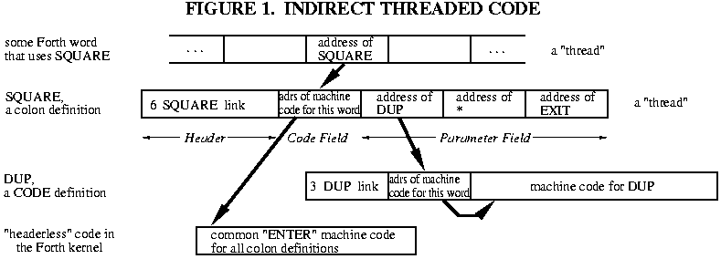

Assume SQUARE is encountered while executing some other Forth word.
Forth's Interpreter Pointer (IP) will be pointing to a cell in memory --
contained within that "other" word -- which contains the address of the
word SQUARE. (To be precise, that cell contains the address of SQUARE's
Code Field.) The interpreter fetches that address, and then uses it to
fetch the contents of SQUARE's Code Field. These contents are yet
another address -- the address of a machine language subroutine which
performs the word SQUARE. In pseudo-code, this is:

``` 
   (IP) -> W  fetch memory pointed by IP into "W" register
              ...W now holds address of the Code Field
   IP+2 -> IP advance IP, just like a program counter
              (assuming 2-byte addresses in the thread)
   (W) ->  X  fetch memory pointed by W into "X" register
              ...X now holds address of the machine code 
   JP (X)     jump to the address in the X register
```

This illustrates an important but rarely-elucidated principle:
<span class="underline">the address of the Forth word just entered is
kept in W.</span> CODE words don't need this information, but all other
kinds of Forth words do.

If SQUARE were written in machine code, this would be the end of the
story: that bit of machine code would be executed, and then jump back to
the Forth interpreter -- which, since IP was incremented, is pointing to
the <span class="underline">next</span> word to be executed. This is why
the Forth interpreter is usually called NEXT.

But, SQUARE is a high-level "colon" definition -- it holds a "thread", a
list of addresses. In order to perform this definition, the Forth
interpreter must be re-started at a new location: the Parameter Field of
SQUARE. Of course, the interpreter's old location must be saved, to
resume the "other" Forth word once SQUARE is finished. This is just like
a subroutine call\! The machine language action of SQUARE is simply to
push the old IP, set IP to a new location, run the interpreter, and when
SQUARE is done pop the IP. (As you can see, the IP is the "program
counter" of high-level Forth.) This is called DOCOLON or ENTER in
various Forths:

``` 
   PUSH IP     onto the "return address stack"
   W+2 -> IP   W still points to the Code Field, so W+2 is 
               the address of the Body!  (Assuming a 2-byte
               address -- other Forths may be different.)
   JUMP to interpreter ("NEXT")
```

This identical code fragment is used by all high-level (i.e., threaded)
Forth definitions\! That's why a pointer to this code fragment, not the
fragment itself, is included in the Forth definition. Over hundreds of
definitions, the savings add up\! And this is why it's called Indirect
threading.

The "return from subroutine" is the word EXIT, which gets compiled when
Forth sees ';'. (Some Forths call it ;S instead of EXIT.) EXIT just
executes a machine language routine which does the following:

``` 
   POP IP   from the "return address stack"
   JUMP to interpreter
```

Walk through a couple of nested Forth definitions, just to assure
yourself that this works.

Note the characteristics of ITC: <span class="underline">every</span>
Forth word has a one-cell Code Field. Colon definitions compile one cell
for each word used in the definition. And the Forth interpreter must
actually perform a <span class="underline">double</span> indirection to
get the address of the next machine code to run (first through IP, then
through W).

ITC is neither the smallest nor the fastest threading technique. It may
be the simplest; although DTC (described next) is really no more
complex. So why are so many Forths indirect-threaded? Mainly because
<span class="underline">previous</span> Forths, used as models, were
indirect- threaded. These days, DTC is becoming more popular.

So when should ITC be used? Of the various techniques, ITC produces the
cleanest and most elegant definitions -- nothing but addresses. If
you're attuned to such considerations, ITC may appeal to you. If your
code fiddles around with the insides of definitions, the simplicity and
uniformity of the ITC representation may enhance portability. ITC is the
classical Forth model, so it may be preferred for education. Finally, on
CPUs lacking a subroutine call instruction -- such as the 1802 -- ITC is
often more efficient than DTC.

### Direct Threaded Code (DTC)

Direct Threaded Code differs from ITC in only one respect: instead of
the Code Field containing the address of some machine code,
<span class="underline">the Code Field contains actual machine code
itself.</span>

I'm not saying that the complete code for ENTER is contained in each and
every colon definition\! In "high-level" Forth words, the Code Field
will contain <span class="underline">a subroutine call</span>, as shown
in Figure 2. Colon definitions, for instance, will contain a call to the
ENTER routine.

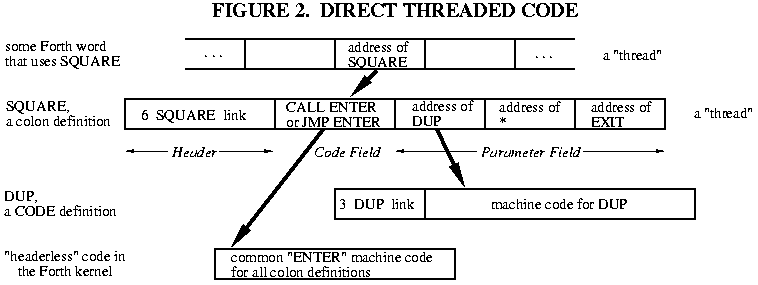

The NEXT pseudo-code for direct threading is simply:

``` 
   (IP) -> W   fetch memory pointed by IP into "W" register
   IP+2 -> IP  advance IP (assuming 2-byte addresses)
   JP (W)      jump to the address in the W register
```

This gains speed: the interpreter now performs only a
<span class="underline">single</span> indirection. On the Z80 this
reduces the NEXT routine -- the most-used code fragment in the Forth
kernel -- from eleven instructions to seven\!

This costs space: every high-level definition in a Z80 Forth (for
example) is now one byte longer, since a 2-byte address has been
replaced by a 3-byte call. But <span class="underline">this is not
universally true.</span> A 32-bit 68000 Forth may replace a 4-byte
address with a 4-byte BSR instruction, for no net loss. And on the Zilog
Super8, which has machine instructions for DTC Forth, the 2-byte address
is replaced by a 1-byte ENTER instruction, making a DTC Forth
<span class="underline">smaller</span> on the Super8\!

Of course, DTC CODE definitions are two bytes shorter, since they no
longer need a pointer at all\!

I used to think that high-level definitions in DTC Forths required the
use of a subroutine call in the Code Field. Frank Sergeant's Pygmy Forth
\[SER90\] demonstrates that a simple jump can be used just as easily,
and will usually be faster.

Guy Kelly has compiled a superb review of Forth implementations for the
IBM PC \[KEL92\], which I strongly recommend to
<span class="underline">all</span> Forth kernel writers. Of the 19
Forths he studied, 10 used DTC, 7 used ITC, and 2 used subroutine
threading (discussed next). <span class="underline">I recommend the use
of Direct-Threaded Code over Indirect-Threaded Code for all new Forth
kernels.</span>

### Jump to NEXT, or code it in-line?

The Forth inner interpreter, NEXT, is a common routine to all CODE
definitions. You might keep just one copy of this common routine, and
have all CODE words jump to it. (Note that you Jump to NEXT; a
subroutine Call is not necessary.)

However, the speed of NEXT is crucial to the speed of the entire Forth
system. Also, on many CPUs, the NEXT routine is quite short; often only
two or three instructions. So it may be preferable to code NEXT in-line,
wherever it is used. This is frequently done by making NEXT an assembler
macro.

This is a simple speed vs. space decision: in-line NEXT is always
faster, but almost always larger. The total size increase is the number
of extra bytes required for in-line expansion, times the number of CODE
words in the system. Sometimes there's no tradeoff at all: in a 6809 DTC
Forth, an in-line NEXT is <span class="underline">shorter</span> than a
Jump instruction\!

### Subroutine Threaded Code (STC)

A high-level Forth definition is nothing but a list of subroutines to be
executed. You don't need interpreters to accomplish this; you can get
the same effect by simply stringing a list of subroutine calls together:

    SQUARE: CALL DUP
            CALL *     ; or a suitable alphanumeric name
            RET

See Figure 3. This representation of Forth words has been used as a
starting point to explain Forth threading techniques to assembly
language programmers \[KOG82\].

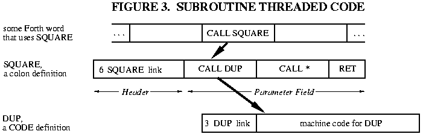

STC is an elegant representation; colon definitions and CODE words are
now identical. "Defined words" (VARIABLEs, CONSTANTs, and the like) are
handled the same as in DTC -- the Code Field begins with a jump or call
to some machine code elsewhere.

The major disadvantage is that subroutine calls are usually larger than
simple addresses. On the Z80, for example, the size of colon definitions
increases by 50% -- and most of your application is colon definitions\!
Contrariwise, on a 32-bit 68000 there may be no size increase at all,
when 4-byte addresses are replaced with 4-byte BSRs. (But if your code
size exceeds 64K, some of those addresses must be replaced with 6-byte
JSRs.)

Subroutine threading <span class="underline">may</span> be faster than
direct threading. You save time by not having an interpreter, but you
lose time because <span class="underline">every</span> reference to a
Forth word involves a push and pop of a return address. In a DTC Forth,
only high-level words cause activity on the return stack. On the 6809 or
Zilog Super8, DTC is faster than STC.

There is another advantage to STC: it dispenses with the IP register.
Some processors -- like the 8051 -- are desperately short of addressing
registers. Eliminating the IP can really simplify and speed up the
kernel\!

<span class="underline">The only way to know for sure is to write sample
code.</span> This is intimately involved with register selection,
discussed in the next section.

### STC with in-line expansion; optimization; direct compilation

On older and 8-bit CPUs, almost every Forth primitive involves several
machine instructions. But on more powerful CPUs, many Forth primitives
are written in a single instruction. For example, on the 32-bit 68000,
DROP is simply

``` 
   ADDQ #4,An     where An is Forth's PSP register
```

In a subroutine-threaded Forth, using DROP in a colon definition would
result in the sequence

``` 
   BSR ...
   BSR DROP  ------->   DROP: ADDQ #4,An
   BSR ...   <-------         RTS
```

ADDQ is a two-byte instruction. Why write a four-byte subroutine call to
a two-byte instruction? No matter how many times DROP is used, there's
no savings\! The code is smaller and faster if the ADDQ is coded
directly into the stream of BSRs. Some Forth compilers do this "in-line
expansion" of CODE words \[CUR93a\].

The disadvantage of in-line expansion is that decompiling back to the
original source code becomes very difficult. As long as subroutine calls
are used, you still have pointers (the subroutine addresses) to the
Forth words comprising the thread. With pointers to the words, you can
obtain their names. But once a word is expanded into in-line code, all
knowledge of where that code came from is lost.

The advantage of in-line expansion -- aside from speed and size -- is
the potential for code optimization. For example, the Forth sequence

``` 
   3 +  
```

would be compiled in 68000 STC as

``` 
   BSR LIT
   .DW  3 
   BSR PLUS
```

but could be expanded in-line as a <span class="underline">single</span>
machine instruction\!

Optimizing Forth compilers is too broad a topic for this article. This
is an active area of Forth language research; see, for instance,
\[SCO89\] and \[CUR93b\]. The final culmination of optimized STC is a
Forth which compiles to "pure" machine code, just like a C or Fortran
compiler.

### Token Threaded Code (TTC)

DTC and STC aim to improve the speed of Forth programs, at some cost in
memory. Now let's move the <span class="underline">other</span>
direction from ITC, toward something slower but smaller.

The purpose of a Forth thread is to specify a list of Forth words
(subroutines) to be performed. Suppose a 16-bit Forth system only had a
maximum of 256 different words. Then each word could be uniquely
identified by an 8-bit number. Instead of a list of 16-bit addresses,
you would have a list of 8-bit identifiers or "tokens," and the size of
the colon definitions would be halved\!

A token-threaded Forth keeps a table of addresses of all Forth words, as
shown in Figure 4. The token value is then used to index into this
table, to find the Forth word corresponding to a given token. This
<span class="underline">adds</span> one level of indirection to the
Forth interpreter, so it is slower than an "address-threaded" Forth.

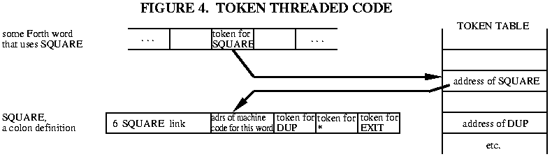

The principal advantage of token-threaded Forths is small size. TTC is
most commonly seen in handheld computers and other severely
size-constrained applications. Also, the table of "entry points" into
all the Forth words can simplify linkage of separately-compiled modules.

The disadvantage of TTC is speed: TTC makes the slowest Forths. Also,
the TTC compiler is slightly more complex. If you need more than 256
Forth words, it's necessary to have some open-ended encoding scheme to
mix 8-bit and larger tokens.

I can envision a 32-bit Forth using 16-bit tokens, but how many 32-bit
systems are size-constrained?

### Segment Threaded Code

Since there are so many 8086 derivatives in the world, segment threading
deserves a brief mention. Instead of using "normal" byte addresses
within a 64K segment, <span class="underline">paragraph</span> addresses
are used. (A "paragraph" is 16 bytes in the 8086.) Then, the interpreter
can load these addresses into segment registers, instead of into the
usual address registers. This allows a 16- bit Forth model to
efficiently access the full megabyte of 8086 memory.

The principal disadvantage of segment threading is the 16-byte
"granularity" of the memory space. Every Forth word must be aligned to a
16-byte boundary. If Forth words have random lengths, an average of 8
bytes will be wasted per Forth word.

## REGISTER ALLOCATION

Next to the threading technique, the usage of the CPU's registers is the
most crucial design decision. It's probably the most difficult. The
availability of CPU registers can determine what threading technique can
be used, and even what the memory map will be\!

### The Classical Forth Registers

The classical Forth model has five "virtual registers." These are
abstract entities which are used in the primitive operations of Forth.
NEXT, ENTER, and EXIT were defined earlier in terms of these abstract
registers.

Each of these is one cell wide -- i.e., in a 16-bit Forth, these are
16-bit registers. (There are exceptions to this rule, as you will see
later.) These <span class="underline">may not all be CPU
registers.</span> If your CPU doesn't have enough registers, some of
these can be kept in memory. I'll describe them in the order of their
importance; i.e., the bottom of this list are the best candidates to be
stored in memory.

**W** is the Working register. It is used for many things, including
memory reference, so it should be an address register; i.e., you must be
able to fetch and store memory using the contents of W as the address.
You also need to be able to do arithmetic on W. (In DTC Forths, you must
also be able to jump indirect using W.) W is used by the interpreter
<span class="underline">in every Forth word</span>. In a CPU having only
one register, you would use it for W and keep everything else in memory
(and the system would be incredibly slow).

**IP** is the Interpreter Pointer. This is used by
<span class="underline">every Forth word</span> (through NEXT, ENTER, or
EXIT). IP must be an address register. You also need to be able to
increment IP. Subroutine threaded Forths don't need this register.

**PSP** is the Parameter Stack (or "data stack") Pointer, sometimes
called simply SP. I prefer PSP because SP is frequently the name of a
CPU register, and they shouldn't be confused. Most CODE words use this.
PSP must be a stack pointer, or an address register which can be
incremented and decremented. It's also a plus if you can do indexed
addressing from PSP.

**RSP** is the Return Stack Pointer, sometimes called simply RP. This is
used by colon definitions in ITC and DTC Forths, and by
<span class="underline">all</span> words in STC Forths. RSP must be a
stack pointer, or an address register which can be incremented and
decremented.

If <span class="underline">at all possible</span>, put W, IP, PSP, and
RSP in registers. The virtual registers that follow can be kept in
memory, but there is usually a speed advantage to keeping them in CPU
registers.

**X** is a working register, <span class="underline">not</span>
considered one of the "classical" Forth registers, even though the
classical ITC Forths need it for the second indirection. In ITC you must
be able to jump indirect using X. X may also be used by a few CODE words
to do arithmetic and such. This is particularly important on processors
that cannot use memory as an operand. For example, ADD on a Z80 might be
(in pseudo-code)

``` 
   POP W   POP X   X+W -> W   PUSH W 
```

Sometimes another working register, Y, is also defined.

**UP** is the User Pointer, holding the base address of the task's user
area. UP is usually added to an offset, and used by high-level Forth
code, so it can be just stored somewhere. But if the CPU can do indexed
addressing from the UP register, CODE words can more easily and quickly
access user variables. If you have a surplus of address registers, use
one for UP. Single-task Forths don't need UP.

X -- if needed -- is more important to keep in register than UP. UP is
the easiest of the Forth virtual registers to move into memory.

### Use of the Hardware Stack

Most CPUs have a stack pointer as part of their hardware, used by
interrupts and subroutine calls. How does this map into the Forth
registers? Should it be the PSP or the RSP?

The short answer is, <span class="underline">it depends</span>. It is
said that the PSP is used more than the RSP in ITC and DTC Forths. If
your CPU has few address registers, and PUSH and POP are faster than
explicit reference, use the hardware stack as the Parameter Stack.

On the other hand, if your CPU is rich in addressing modes -- and allows
indexed addressing -- there's a plus in having the PSP as a
general-purpose address register. In this case, use the hardware stack
as the Return Stack.

Sometimes you do neither\! The TMS320C25's hardware stack is only eight
cells deep -- all but useless for Forth. So its hardware stack is used
<span class="underline">only</span> for interrupts, and both PSP and RSP
are general-purpose address registers. (ANS Forth specifies a minimum of
32 cells of Parameter Stack and 24 cells of Return Stack; I prefer 64
cells of each.)

You will occasionally encounter the dogma that the hardware stack "must
be" the Parameter Stack, or "must be" the Return Stack. Instead, code
some sample Forth primitives, such as

``` 
   SWAP  OVER  @  !  +  0=  
```

and see which approach is smaller or faster. (DUP and DROP, by the way,
are no test -- they're usually trivial.)

Occasionally you reach strange conclusions\! Gary Bergstrom has pointed
out that a 6809 DTC Forth can be made a few cycles faster by using the
6809 user stack pointer as the <span class="underline">IP</span>; NEXT
becomes a POP. He uses an index register for one of Forth's stacks.

### Top-Of-Stack in Register

Forth's performance can be improved considerably by keeping the top
element of the Parameter Stack in a register\! Many Forth words (such as
0=) then don't need to use the stack. Other words still do the same
number of pushes and pops, only in a different place in the code. Only a
few Forth words (DROP and 2DROP) become more complicated, since you can
no longer simply adjust the stack pointer -- you have to update the TOS
register as well.

There are a few rules when writing CODE words:

A word which <span class="underline">removes</span> items from the stack
must pop the "new" TOS into its register.

A word which <span class="underline">adds</span> items to the stack must
push the "old" TOS onto the stack (unless, of course, it's consumed by
the word).

<span class="underline">If you have at least six cell-size CPU
registers, I recommend keeping the TOS in a register.</span> I consider
TOS more important than UP to have in register, but less important than
W, IP, PSP, and RSP. (TOS in register performs many of the functions of
the X register.) It's useful if this register can perform memory
addressing. PDP-11s, Z8s, and 68000s are good candidates.

Nine of the 19 IBM PC Forths studied by Guy Kelly \[KEL92\] keep TOS in
register.

I think this innovation has been resisted because of the false beliefs
that a) it adds instructions, and b) the top stack element must be
accessible as memory. It turns out that even such words as PICK, ROLL,
and DEPTH are trivially modified for TOS-in-register.

What about buffering <span class="underline">two</span> stack elements
in registers? When you keep the top of stack in a register, the total
number of operations performed remains essentially the same. A push
remains a push, regardless of whether it is before or after the
operation you're performing. On the other hand, buffering two stack
elements in registers <span class="underline">adds</span> a large number
of instructions -- a push becomes a push followed by a move. Only
dedicated Forth processors like the RTX2000 and fantastically clever
optimizing compilers can benefit from buffering two stack elements in
registers.

### Some examples

Here are the register assignments made by Forths for a number of
different CPUs. Try to deduce the design decisions of the authors from
this list.

``` 
             Figure 5. Register Assignments

            W     IP    PSP   RSP   UP     TOS   

8086[1]     BX    SI    SP    BP    memory memory  [LAX84]
8086[2]     AX    SI    SP    BP    none   BX      [SER90]
68000       A5    A4    A3    A7=SP A6     memory  [CUR86]
PDP-11      R2    R4    R5    R6=SP R3     memory  [JAM80]
6809        X     Y     U     S     memory memory  [TAL80]
6502        Zpage Zpage X     SP    Zpage  memory  [KUN81]
Z80         DE    BC    SP    IX    none   memory  [LOE81]
Z8          RR6   RR12  RR14  SP    RR10   RR8     [MPE92]
8051        R0,1  R2,3  R4,5  R6,7  fixed  memory  [PAY90]

[1] F83.  [2] Pygmy Forth.
```

"SP" refers to the hardware stack pointer. "Zpage" refers to values kept
in the 6502's memory page zero, which are almost as useful as --
sometimes more useful than -- values kept in registers; e.g., they can
be used for memory addressing. "Fixed" means that Payne's 8051 Forth has
a single, immovable user area, and UP is a hard-coded constant.

### Narrow Registers

Notice anything odd in the previous list? The 6502 Forth -- a 16-bit
model -- uses <span class="underline">8-bit</span> stack pointers\!

It is possible to make PSP, RSP, and UP smaller than the cell size of
the Forth. This is because the stacks and user area are both relatively
small areas of memory. Each stack may be as small as 64 cells in length,
and the user area rarely exceeds 128 cells. You simply need to ensure
that either a) these data areas are confined to a small area of memory,
so a short address can be used, or b) the high address bits are provided
in some other way, e.g., a memory page select.

In the 6502, the hardware stack is confined to page one of RAM
(addresses 01xxh) by the design of the CPU. The 8-bit stack pointer can
be used for the Return Stack. The Parameter Stack is kept in page zero
of RAM, which can be indirectly accessed by the 8-bit index register X.
(Question for the advanced student: why use the 6502's X, and not Y?
Hint: look at the addressing modes available.)

In the 8051, you can use the 8-bit registers R0 and R1 to address
external RAM, provided that you explicitly output the high 8 bits of
address to port 2. This allows a "page select" for two stacks.

UP is different from PSP and RSP: it simply provides a base address; it
is never incremented or decremented. So it's practical to supply only
the <span class="underline">high</span> bits of this virtual register.
The low bits must then be provided by whatever indexed addressing
technique is used. For example, on the 6809, you can use the DP register
to hold the high 8 bits of UP, and then use Direct Page addressing to
access any of the 256 locations in this page. This forces all user areas
to begin on an address xx00h, which is no great hardship, and limits the
user area to 128 cells in length.

On the 8086 you could conceivably use a segment register to specify the
base address of the user area.

## REFERENCES

\[CUR93a\] Curley, Charles, "Life in the FastForth Lane," awaiting
publication in Forth Dimensions. Description of a 68000
subroutine-threaded Forth.

\[CUR93b\] Curley, Charles, "Optimizing in a BSR/JSR Threaded Forth,"
awaiting publication in Forth Dimensions. Single-pass code optimization
for FastForth, in only five screens of code\! Includes listing.

\[KEL92\] Kelly, Guy M., "Forth Systems Comparisons," Forth Dimensions
XIII:6 (Mar/Apr 1992). Also published in the
<span class="underline">1991 FORML Conference Proceedings</span>. Both
available from the Forth Interest Group, P.O. Box 2154, Oakland, CA
94621. Illustrates design tradeoffs of many 8086 Forths with code
fragments and benchmarks -- highly recommended\!

\[KOG82\] Kogge, Peter M., "An Architectural Trail to Threaded- Code
Systems," IEEE Computer, vol. 15 no. 3 (Mar 1982). Remains the
definitive description of various threading techniques.

\[ROD91\] Rodriguez, B.J., "B.Y.O. Assembler," Part 1, The Computer
Journal \#52 (Sep/Oct 1991). General principles of writing Forth
assemblers.

\[ROD92\] Rodriguez, B.J., "B.Y.O. Assembler," Part 2, The Computer
Journal \#54 (Jan/Feb 1992). A 6809 assembler in Forth.

\[SCO89\] Scott, Andrew, "An Extensible Optimizer for Compiling Forth,"
<span class="underline">1989 FORML Conference Proceedings</span>, Forth
Interest Group, P.O. Box 2154, Oakland, CA 94621. Good description of a
68000 optimizer; no code provided.

**Forth Implementations**

\[CUR86\] Curley, Charles, <span class="underline">real-Forth for the
68000</span>, privately distributed (1986).

\[JAM80\] James, John S., <span class="underline">fig-Forth for the
PDP-11</span>, Forth Interest Group (1980).

\[KUN81\] Kuntze, Robert E., <span class="underline">MVP-Forth for the
Apple II</span>, Mountain View Press (1981).

\[LAX84\] Laxen, H. and Perry, M., <span class="underline">F83 for the
IBM PC</span>, version 2.1.0 (1984). Distributed by the authors,
available from the Forth Interest Group or GEnie.

\[LOE81\] Loeliger, R. G., <span class="underline">Threaded Interpretive
Languages</span>, BYTE Publications (1981), ISBN 0-07-038360-X. May be
the only book ever written on the subject of creating a Forth-like
kernel (the example used is the Z80). Worth it if you can find a copy.

\[MPE92\] MicroProcessor Engineering Ltd., <span class="underline">MPE
Z8/Super8 PowerForth Target</span>, MPE Ltd., 133 Hill Lane, Shirley,
Southampton, S01 5AF, U.K. (June 1992). A commercial product.

\[PAY90\] Payne, William H., <span class="underline">Embedded Controller
FORTH for the 8051 Family</span>, Academic Press (1990), ISBN
0-12-547570-5. This is a complete "kit" for a 8051 Forth, including a
metacompiler for the IBM PC. Hardcopy only; files can be downloaded from
GEnie. Not for the novice\!

\[SER90\] Sergeant, Frank, <span class="underline">Pygmy Forth for the
IBM PC</span>, version 1.3 (1990). Distributed by the author, available
from the Forth Interest Group. Version 1.4 is now available on GEnie,
and worth the extra effort to obtain.

\[TAL80\] Talbot, R. J., <span class="underline">fig-Forth for the
6809</span>, Forth Interest Group (1980).

*Author's note for web publication: the files formerly available on the
GEnie online service are now available from the Forth Interest Group FTP
server, <ftp://ftp.forth.org/pub/Forth>.*

[Continue with Part 2](moving2.htm) | [Back to publications
page](index.html)

# MOVING FORTH

## Part 2: Benchmarks and Case Studies of Forth Kernels

### by Brad Rodriguez

This article first appeared in [The Computer
Journal](http://www.psyber.com/~tcj) \#60 (March/April 1993).

## BENCHMARKS

By now it must seem that the answer to every design question is "code it
and see." Obviously you don't want to write the entire Forth kernel
several different ways just to evaluate different schemes. Fortunately,
you can get quite a good "feel" with just a small subset of the Forth
kernel.

Guy Kelly \[KEL92\] examines the following code samples for 19 different
IBM PC Forths:

NEXT ...the "inner interpreter" that chains from one Forth word to
another in the "thread". This is used at the end of every CODE
definition, and is one of the most important factors in speed of Forth
execution. You've already seen the pseudo-code for this in ITC and DTC;
in STC it's just CALL/RETURN.

ENTER ...also called DOCOL or DOCOLON; the Code Field action that causes
a high level "colon" definition to be executed. This, too, is crucial
for speed; it is used at the start of every colon definition. Not needed
in STC.

EXIT ...called ;S in fig-Forth; the code that ends the execution of a
colon definition. This is essentially the high-level subroutine return,
and appears at the end of every colon definition. This is just a machine
code RETURN in STC.

NEXT, ENTER, and EXIT indicate the performance of the threading
mechanism. These should be coded to evaluate ITC vs. DTC vs. STC. They
also reflect the quality of your register assignments for IP, W, and
RSP.

DOVAR ...a.k.a. "variable"; the machine code fragment that is the Code
Field action for all Forth VARIABLEs.

DOCON ...a.k.a. "constant"; the machine code fragment that is the Code
Field action for all Forth CONSTANTs.

DOCON and DOVAR, along with ENTER, show how efficiently you can obtain
the Parameter Field address of a word being executed. This reflects your
choice for the W register. In a DTC Forth, this also indicates whether
to put a JUMP or CALL in the Code Field.

LIT ...a.k.a. "literal"; is a Forth word that fetches a cell value from
the high-level thread. Several words use such in-line parameters, and
this is a good indicator of their performance. It reflects your choice
for the IP register.

@ ...the Forth memory-fetch operator, shows how quickly memory can be
accessed from high-level Forth. This word usually benefits from TOS in
stack.

\! ...the Forth memory-store operator, is another indicator of memory
access. This consumes two items from the stack, and illustrates
efficiency of Parameter Stack access. It's a good indicator of the
TOS-in-memory vs. TOS-in-register tradeoff.

\+ ...the addition operator, is a representative example of all the
Forth arithmetic and logical operators. Like the \! word, this
benchmarks stack access, and it's a clear demonstration of any
TOS-in-register benefit.

This is an excellent set of code samples. I have a few additional
favorites:

DODOES ...is the Code Field action for words built with DOES\>. This
doesn't yield any new benchmark comparisons, although it does reflect
the usefulness of W, IP, and RSP. I include it because it's the most
convoluted code in the Forth kernel. If you can code the logic of
DODOES, everything else is a snap. The intricacies of DODOES will be
described in a subsequent article.

SWAP ...a simple stack operator, but still educational.

OVER ...a more complex stack operator. This gives a good idea of how
easily you can access the Parameter Stack.

ROT ...a still more complex stack operator, and the one most likely to
need an extra temporary register. If you can code ROT without needing an
"X" register, you probably don't need an "X" register for anything.

0= ...one of the few unary arithmetic operators, and one of the most
likely to benefit from TOS-in-register.

\+\! ...a most illustrative operator, combining stack access,
arithmetic, memory fetch and store. This is one of my favorite
benchmarks, although it is less frequently used than the other words in
this list.

These are among the most-used words in the Forth kernel. It pays to
optimize them. I'll show examples of all of these, including
pseudo-code, for the 6809. For the other CPUs, I'll use selected
examples to illustrate specific decisions.

## **CASE STUDY 1: THE 6809**

In the world of 8-bit CPUs, the 6809 is the Forth programmer's dream
machine. It supports <span class="underline">two</span> stacks\! It also
has two other address registers, and a wealth of orthogonal addressing
modes second only to the PDP-11. ("Orthogonal" means they work the same
way and have the same options for all address registers.) The two 8-bit
accumulators can be treated as a single 16-bit accumulator, and there
are many 16-bit operations.

The programmer's model of the 6809 is \[MOT83\]:

A - 8 bit accumulator  
B - 8 bit accumulator

Most arithmetic operations use an accumulator as the destination. These
can be concatenated and treated as a single 16-bit accumulator D (A high
byte, B low).

X - 16 bit index register  
Y - 16 bit index register  
S - 16 bit stack pointer  
U - 16 bit stack pointer

All addressing modes for X and Y can also be used with the S and U
registers.

PC - 16 bit program counter  
CC - 8 bit Condition Code register  
DP - 8 bit Direct Page register

The 6800 family's Direct addressing mode uses an 8-bit address to reach
any location in memory page zero. The 6809 allows
<span class="underline">any</span> page to be Direct-addressed; this
register provides the high 8 bits of address.

Those two stack pointers are crying out for Forth use. They are
equivalent, except that S is used for subroutine calls and interrupts.
Let's be consistent and use S for return addresses, leaving U for the
Parameter Stack.

W and IP both need to be address registers, so these are the logical use
for X and Y. X and Y are equivalent, so let's arbitrarily assign X=W,
and Y=IP.

Now a threading model can be chosen. I'll scratch STC and TTC, to make
this a "conventional" Forth. The limiting factor in performance is then
the NEXT routine. Let's look at this in both ITC and DTC:

    ITC-NEXT: LDX ,Y++   (8) (IP)->W, increment IP
              JMP [,X]   (6) (W)->temp, jump to adrs in temp
    
    DTC-NEXT: JMP [,Y++] (9) (IP)->temp, increment IP,
                             jump to adrs in temp
                             ("temp" is internal to the 6809)

NEXT is one instruction in a DTC 6809\! This means you can code it
in-line in two bytes, making it both smaller and faster than JMP NEXT.
For comparison, look at the "NEXT" logic for subrou\~ tine threading:

``` 
        RTS           (5) ...at the end of one CODE word 
        JSR nextword  (8) ...in the "thread"
        ...               ...start of the next CODE word
```

STC takes 13 clocks to thread to the next word, compared with 9 clocks
for DTC. This is because subroutine threading has to pop and push a
return address, while simple DTC or ITC threading between CODE words
does not.

Given the choice of DTC, you have to decide: does a high-level word have
a Jump or Call in its Code Field? The driving consid\~ eration is
<span class="underline">how quickly can you obtain the address of the
parame\~ ter field which follows?</span> Let's look at the code to ENTER
a colon definition, using symbolic Forth register names, to see this
illustrated:

using a JSR (Call):

``` 
        JSR ENTER   (8)
        ...
ENTER:  PULS W      (7) get address following JSR into W reg
        PSHS IP     (7) save the old IP on the Return Stack
        TFR  W,IP   (6) Parameter Field address -> IP
        NEXT        (9) assembler macro for JMP [,Y++] 
                    37 cycles total
```

using a JMP:

``` 
        JMP ENTER   (4)
         ...
ENTER:  PSHS IP     (7) save the old IP on the Return Stack
        LDX -2,IP   (6) re-fetch the Code Field address
        LEAY 3,X    (5) add 3 and put into IP (Y) register
        NEXT        (9)
                    31 cycles total

                    (CPU cycle counts are in parentheses.)
```

The DTC 6809 NEXT doesn't use the W register, because the 6809
addressing modes allow an extra level of indirection automatically. The
JMP version of ENTER has to re-fetch the Code Field address -- NEXT
didn't leave it in any register -- and then add 3 to get the Parameter
Field address. The JSR version can get the Parameter Field address
directly by popping the return stack. Even so, the JMP version is
faster. (Exercise for the student: try coding the JSR ENTER with S=PSP
and U=RSP.)

Either way, the code for EXIT is the same:

    EXIT:   PULS IP     pop "saved" IP from return stack
            NEXT        continue Forth interpretation

Some registers remain to allocate. You could keep the User Pointer in
memory, and this Forth would still be pretty fast. But the DP register
would go to waste, and there's not much else it can do. Let's use the
"trick" described above, and hold the high byte of UP in the DP
register. (The low byte of UP is implied to be zero).

One 16-bit register is left: D. Most arithmetic operations need this
register. Should it be left free as a scratch register, or used as the
Top-Of-Stack? 6809 instructions use memory as one operand, so a second
working register may be unnecessary. And if a scratch register is
needed, it's easy to push and pop D. Let's write the benchmark
primitives both ways, and see which is faster.

NEXT, ENTER, and EXIT don't use the stack, and thus have identical code
either way.

DOVAR, DOCON, LIT, and OVER require the same number of CPU cycles either
way. These illustrate the earlier comment that putting TOS in register
often just changes <span class="underline">where</span> the push or pop
takes place:

``` 
        TOS in D        TOS in memory   pseudo-code

DOVAR:  PSHU TOS        LDD  -2,IP      address of CF -> D
        LDD  -2,IP      ADDD #3         address of PF -> D
        ADDD #3         PSHU D          push D onto stack
        NEXT            NEXT

DOCON:  PSHU TOS        LDX  -2,IP      address of CF -> W
        LDX  -2,IP      LDD  3,X        contents of PF -> D
        LDD  3,X        PSHU D          push D onto stack
        NEXT            NEXT

LIT:    PSHU TOS        LDD  ,IP++      (IP) -> D, increment IP
        LDD  ,IP++      PSHU D          push D onto stack
        NEXT            NEXT

OVER:   PSHU D          LDD  2,PSP      2nd on stack -> D
        LDD  2,PSP      PSHU D          push D onto stack
        NEXT            NEXT
```

SWAP, ROT, 0=, @, and especially + are all
<span class="underline">faster</span> with TOS in register:

``` 
 
        TOS in D        TOS in memory   pseudo-code

SWAP:   LDX  ,PSP (5)   LDD  ,PSP (5)   TOS -> D
        STD  ,PSP (5)   LDX 2,PSP (6)   2nd on stack -> X
        TFR  X,D  (6)   STD 2,PSP (6)   D -> 2nd on stack
        NEXT            STX  ,PSP (5)   X -> TOS
                        NEXT

ROT:    LDX  ,PSP (5)   LDX  ,PSP (5)   TOS -> X
        STD  ,PSP (5)   LDD 2,PSP (6)   2nd on stack -> D
        LDD 2,PSP (6)   STX 2,PSP (6)   X -> 2nd on stack
        STX 2,PSP (6)   LDX 4,PSP (6)   3rd on stack -> X
        NEXT            STD 4,PSP (6)   D -> 3rd on stack
                        STX  ,PSP (5)   X -> TOS
                        NEXT 

0=:     CMPD #0         LDD  ,PSP       TOS -> D
        BEQ  TRUE       CMPD #0         does D equal zero?
                        BEQ  TRUE
  FALSE:LDD  #0         LDD  #0         no...put 0 in TOS
        NEXT            STD  ,PSP
                        NEXT
  TRUE: LDD  #-1        LDD  #-1        yes...put -1 in TOS
        NEXT            STD  ,PSP
                        NEXT  

@:      TFR TOS,W (6)   LDD [,PSP] (8)  fetch D using TOS adrs
        LDD  ,W   (5)   STD  ,PSP  (5)  D -> TOS
        NEXT            NEXT

+:      ADDD ,U++       PULU D          pop TOS into D
        NEXT            ADDD ,PSP       add new TOS into D
                        STD  ,PSP       store D into TOS
                        NEXT
```

\! and +\! are <span class="underline">slower</span> with TOS in
register:

``` 
 
        TOS in D        TOS in memory   pseudo-code

!:      TFR TOS,W (6)   PULU W   (7)    pop adrs into W
        PULU D    (7)   PULU D   (7)    pop data into D
        STD  ,W   (5)   STD  ,W  (5)    store data to adrs
        PULU TOS  (7)   NEXT
        NEXT

+!:     TFR TOS,W (6)   PULU W   (7)    pop adrs into W
        PULU TOS  (7)   PULU D   (7)    pop data into D
        ADDD ,W   (6)   ADDD ,W  (6)    add memory into D
        STD  ,W   (5)   STD  ,W  (5)    store D to memory
        PULU TOS  (7)   NEXT
        NEXT
```

The reason these words are slower is that most Forth memory- reference
words expect the address on the top of stack, so an extra TFR
instruction is needed. This is why it's a help for the TOS register to
be an address register. Unfortunately, all the 6809 address registers
are spoken for...and it's much more important for W, IP, PSP, and RSP to
be in address registers than TOS. The TOS-in-register penalty for \! and
+\! should be outweighed by the gains in the many arithmetic and stack
operations.

## CASE STUDY 2: THE 8051

If the 6809 is the Forthwright's dream machine, the 8051 is the
nightmare. It has only one general-purpose address register, and one
addressing mode, which always uses the one 8-bit accumulator.

All of the arithmetic operations, and many of the logical, must use the
accumulator. The only 16-bit operation is INC DPTR. The hardware stack
must use the 128-byte on-chip register file. \[SIG92\] Such a CPU could
give ulcers.

Some 8051 Forths have been written that implement a full 16-bit model,
e.g. \[PAY90\], but they are too slow for my taste. Let's make some
tradeoffs and make a faster 8051 Forth.

Our foremost reality is the availability of only one address register.
So let's use the 8051's Program Counter as IP -- i.e., let's make a
subroutine-threaded Forth. If the compiler uses 2- byte ACALLs instead
of 3-byte LCALLs whenever possible, most of the STC code will be as
small as ITC or DTC code.

Subroutine threading implies that the Return Stack Pointer is the
hardware stack pointer. There are 64 cells of space in the on- chip
register file, not enough room for multiple task stacks. At this point
you can

a) restrict this Forth to single-task;  
b) code all of the Forth definitions so that upon entry they move their
return address to a software stack in external RAM; or  
c) do task switches by swapping the entire Return Stack to and from
external RAM.

Option (b) is slow\! Moving 128 bytes on every task switch is faster
than moving 2 bytes on every Forth word. For now I choose option (a),
leaving the door open for (c) at some future date.

The one-and-only "real" address register, DPTR, will have to do multiple
duty. It becomes W, the multi-purpose working register.

In truth, there are two other registers that can address external
memory: R0 and R1. They provide only an
<span class="underline">8-bit</span> address; the high 8 bits are
explicitly output on port 2. But this is a tolerable restriction for
stacks, since they can be limited to a 256-byte space. So let's use R0
as the PSP.

This same 256-byte space can be used for user data. This makes P2 (port
2) the high byte of the User Pointer, and, like the 6809, the low byte
will be implied to be zero.

What is the programmer's model of the 8051 so far?

``` 
    reg 8051   Forth
   adrs name   usage

      0  R0    low byte of PSP
      1  R1
      2  R2
      3  R3
      4  R4
      5  R5
      6  R6
      7  R7 
  8-7Fh        120 bytes of return stack
    81h  SP    low byte of RSP (high byte=00)
 82-83h  DPTR  W register
    A0h  P2    high byte of UP and PSP
    E0h  A
    F0h  B
```

Note that this uses only register bank 0. The additional three register
banks from 08h to 1Fh, and the bit-addressable region from 20h to 2Fh,
are of no use to Forth. Using bank 0 leaves the largest contiguous space
for the return stack. Later the return stack can be shrunk, if desired.

The NEXT, ENTER, and EXIT routines aren't needed in a subroutine
threaded Forth.

What about the top of stack? There are plenty of registers, and memory
operations on the 8051 are expensive. Let's put TOS in R3:R2 (with R3 as
the high byte, in Intel fashion). Note that B:A can't be used -- the A
register is the funnel through which <span class="underline">all</span>
memory references must move\!

### Harvard architectures

The 8051 uses a "Harvard" architecture: program and data are kept in
separate memories. (The Z8 and TMS320 are two other examples.) The 8051
is a degenerate case: there is physically no means to write to the
program memory\! This means that a Forthwright can do one of two things:

a) cross-compile everything, including the application, and give up all
hope of putting an interactive Forth compiler on the 8051; or

b) cause some or all of the program memory to also appear in the data
space. The easiest way is to make the two spaces completely overlap, by
logically ORing the active-low PSEN\* and RD\* strobes with an external
AND gate.

The Z8 and TMS320C25 are more civilized: they allow write access to
program memory. The implications for the design of the Forth kernel will
be discussed in subsequent articles.

## CASE STUDY 3: THE Z80

The Z80 is instructive because it is an extreme example of a non-
orthogonal CPU. It has <span class="underline">four different
kinds</span> of address registers\! Some operations use A as
destination, some any 8-bit register, some HL, some any 16-bit register,
and so on. Many operations (such as EX DE,HL) are only defined for one
combination of registers.

In a CPU such as the Z80 (or 8086\!), the assignment of Forth functions
must be carefully matched to the capabilities of the CPU registers. Many
more tradeoffs need to be evaluated, and often the only way is to write
sample code for a number of different assignments. Rather than burden
this article down endless permutations of Forth code, I'll present one
register assignment based on many Z80 code experiments. It turns out
that these choices can be rationalized in terms of the general
principles outlined earlier.

I want a "conventional" Forth, although I
<span class="underline">will</span> use direct threading. All of the
"classical" virtual registers will be needed.

Ignoring the alternate register set, the Z80 has six address registers,
with the following capabilities:

``` 
   BC,DE - LD A indirect, INC, DEC
           also exchange DE/HL

      HL - LD r indirect, ALU indirect, INC, DEC, ADD, ADC, 
           SBC, exchange w/TOS, JP indirect

   IX,IY - LD r indexed, ALU indexed, INC, DEC, ADD, ADC,
           SBC, exchange w/TOS, JP indirect  (all slow)

      SP - PUSH/POP 16-bit, ADD/ADC/SUB to HL/IX/IY
```

BC, DE, and HL can also be manipulated in 8-bit pieces.

The 8-bit register A must be left as a scratch register, since it's the
destination for so many ALU and memory reference operations.

HL is undoubtedly the most versatile register, and at one time or
another it is tempting to use it for each of the Forth virtual
registers. However, <span class="underline">because</span> of its
versatility -- and because it is the only register which can be fetched
byte-wise <span class="underline">and</span> used in an indirect jump --
HL should be used for W, Forth's all-purpose working register.

IX and IY might be considered for the Forth stack pointers, because of
their indexed addressing mode, which can be used in ALU operations. But
there are two problems with this: it leaves SP without a job; and, IX/IY
are too slow\! Most of the operations on either stack involve pushing or
popping 16-bit quantities. This is one instruction using SP, but it
requires <span class="underline">four</span> using IX or IY. One of the
Forth stacks should use SP. And this should be the Parameter Stack,
since it is used more heavily than the Return Stack.

What about Forth's IP? Mostly, IP fetches from memory and
autoincrements, so there's no programming advantage to using IX/IY over
BC/DE. But speed is of the essence with IP, and BC/DE are faster. Let's
put IP in DE: it has the advantage of being able to swap with HL, which
adds versatility.

A second Z80 register pair (other than W) will be needed for 16- bit
arithmetic. Only BC is left, and it can be used for addressing
<span class="underline">or</span> for ALU operations with A. But should
BC be a second working register "X", or the top-of-stack? Only code will
tell; for now, let's optimistically assume that BC=TOS.

This leaves the RSP and UP functions, and the IX and IY registers
unused. IX and IY are equivalent, so let's assign IX=RSP, and IY=UP.

Thus the Z80 Forth register assignments are:

``` 
   BC = TOS   IX = RSP
   DE = IP    IY = UP
   HL = W     SP = PSP
```

Now look at NEXT for the DTC Forth:

    DTC-NEXT: LD A,(DE) (7) (IP)->W, increment IP
              LD L,A    (4)
              INC DE    (6)
              LD A,(DE) (7)
              LD H,A    (4)
              INC DE    (6)
              JP (HL)   (4) jump to address in W

alternate version (same number of clock cycles)

    DTC-NEXT: EX DE,HL  (4) (IP)->W, increment IP
    NEXT-HL:  LD E,(HL) (7)
              INC HL    (6)
              LD D,(HL) (7)
              INC HL    (6)
              EX DE,HL  (4)
              JP (HL)   (4) jump to address in W

Note that cells are stored low-byte first in memory. Also, although it
might seem advantageous to keep IP in HL, it really isn't. This is
because the Z80 can't JP (DE). The NEXT-HL entry point will be used
shortly.

Just for comparison, let's look at an ITC NEXT. The pseudo-code given
previously requires another temporary register "X", whose contents can
be used for an indirect jump. Let DE=X, and BC=IP. TOS will have to be
kept in memory.

``` 
ITC-NEXT: LD A,(BC) (7) (IP)->W, increment IP
          LD L,A    (4)
          INC BC    (6)
          LD A,(BC) (7)
          LD H,A    (4)
          INC BC    (6)

          LD E,(HL) (7) (W)->X
          INC HL    (6)
          LD D,(HL) (7)
          EX DE,HL  (4) jump to address in X
          JP (HL)   (4)  
```

This leaves "W" incremented by one, and in the DE register. As long as
this is done <span class="underline">consistently</span>, there's no
problem -- code needing the contents of W knows where to find it, and
how much to adjust it.

The ITC NEXT is 11 instructions, as compared to 7 for DTC. And ITC on
the Z80 loses the ability to keep TOS in a register. My choice is DTC.

If coded in-line, DTC NEXT would require seven bytes in every CODE word.
A jump to a common NEXT routine would only use three bytes, but would
add 10 clock cycles. This is another of the tradeoff decisions in
designing a Forth kernel. This example is a close call; let's opt for
speed with an in-line NEXT. But sometimes NEXT is so huge, or memory is
so tight, that the prudent decision is to use a JMP NEXT.

Now let's look at the code for ENTER. Using a CALL, the hardware stack
is popped to get the Parameter Field address:

``` 
        CALL ENTER  (17)
        ...
ENTER:  DEC IX      (10) push the old IP on the return stack
        LD (IX+0),D (19)
        DEC IX      (10)
        LD (IX+0),E (19)
        POP DE      (10) Parameter Field address -> IP
        NEXT        (38) assembler macro for 7 instructions
```

Actually it's faster to POP HL, and then use the last six instructions
of NEXT (omitting the EX DE,HL):

``` 
        CALL ENTER  (17)
        ...
ENTER:  DEC IX      (10) push the old IP on the return stack
        LD (IX+0),D (19)
        DEC IX      (10)
        LD (IX+0),E (19)
        POP HL      (10) Parameter Field address -> HL
        NEXT-HL     (34) see DTC NEXT code, above
                    119 cycles total
```

When a JP is used, the W register (HL) is left pointing to the Code
Field. The Parameter Field is 3 bytes after:

``` 
        JP ENTER    (10)
        ...
ENTER:  DEC IX      (10) push the old IP on the return stack
        LD (IX+0),D (19)
        DEC IX      (10)
        LD (IX+0),E (19)
        INC HL      ( 6) Parameter Field address -> IP
        INC HL      ( 6)
        INC HL      ( 6) 
        NEXT-HL     (34)
                    120 cycles total
```

Again, because of the alternate entry point for NEXT, the new value for
IP doesn't actually have to be put into the DE register pair.

The CALL version is one cycle faster. On an embedded Z80, a one- byte
RST instruction could be used to gain speed
<span class="underline">and</span> save space. This option is not
available on many Z80-based personal computers.

## CASE STUDY 4: THE 8086

The 8086 is another instructive CPU. Rather than go through the design
process, let's look at one of the newer shareware Forths for the IBM PC:
Pygmy Forth \[SER90\].

Pygmy is a direct-threaded Forth with the top-of-stack kept in register.
The 8086 register assignments are:

``` 
   AX = W         DI = scratch
   BX = TOS       SI = IP
   CX = scratch   BP = RSP
   DX = scratch   SP = PSP
```

Most 8086 Forths use the SI register for IP, so that NEXT can be written
with the LODSW instruction. In Pygmy the DTC NEXT is:

    NEXT:  LODSW
           JMP AX

This is short enough to include in-line in every CODE word.

High-level and "defined" Forth words use a JMP (relative) to their
machine code. The ENTER routine (called 'docol' in Pygmy) must therefore
get the Parameter Field address from W:

    ENTER:  XCHG SP,BP
            PUSH SI
            XCHG SP,BP
            ADD AX,3    Parameter Field address -> IP
            MOV SI,AX
            NEXT

Note the use of XCHG to swap the two stack pointers. This allows the use
of PUSH and POP instructions for both stacks, which is faster than using
indirect access on BP.

    EXIT:   XCHG SP,BP
            POP SI
            XCHG SP,BP
            NEXT 

### Segment model

Pygmy Forth is a single-segment Forth; all code and data are contained
within a single 64 Kbyte segment. (This is the "tiny model" in Turbo C
lingo.) All of the Forth standards issued to date assume that everything
is contained in a single memory space, accessible with the same fetch
and store operators.

Nevertheless, IBM PC Forths are beginning to appear that use multiple
segments for up to five different kinds of data \[KEL92,SEY89\]. These
are:

CODE ...machine code  
LIST ...high-level Forth threads (a.k.a. THREADS)  
HEAD ...headers of all Forth words  
STACK ...parameter and return stacks  
DATA ...variables and user-defined data

This allows PC Forths to break the 64K limit, without going to the
expense of implementing a 32-bit Forth on a 16-bit CPU. Implementation
of a multi-segment model, and the ramifications for the Forth kernel,
are beyond the scope of this article.

**STILL TO COME...**

Subsequent articles will look at:  
\- design tradeoffs in the Forth header and dictionary search  
\- the logic of CONSTANTs, VARIABLEs, and other data structures  
\- the defining word mechanisms, CREATE...;CODE and CREATE...DOES\>  
\- the assembler vs. metacompiler question  
\- the assembler and high-level code that comprises a Forth kernel  
\- multitasking modifications to the kernel

**REFERENCES**

\[KEL92\] Kelly, Guy M., "Forth Systems Comparisons," Forth Dimensions
XIII:6 (Mar/Apr 1992). Also published in the
<span class="underline">1991 FORML Conference Proceedings</span>. Both
available from the Forth Interest Group, P.O. Box 2154, Oakland, CA
94621. Illustrates design tradeoffs of many 8086 Forths with code
fragments and benchmarks -- highly recommended\!

\[MOT83\] Motorola Inc., <span class="underline">8-Bit Microprocessor
and Peripheral Data</span>, Motorola data book (1983).

\[SIG92\] Signetics Inc., <span class="underline">80C51-Based 8-Bit
Microcontrollers</span>, Signetics data book (1992).

**Forth Implementations**

\[PAY90\] Payne, William H., <span class="underline">Embedded Controller
FORTH for the 8051 Family</span>, Academic Press (1990), ISBN
0-12-547570-5. This is a complete "kit" for a 8051 Forth, including a
metacompiler for the IBM PC. Hardcopy only; files can be downloaded from
GEnie. Not for the novice\!

\[SER90\] Sergeant, Frank, <span class="underline">Pygmy Forth for the
IBM PC</span>, version 1.3 (1990). Distributed by the author, available
from the Forth Interest Group. Version 1.4 is now available on GEnie,
and worth the extra effort to obtain.

\[SEY89\] Seywerd, H., Elehew, W. R., and Caven, P.,
<span class="underline">LOVE-83Forth for the IBM PC</span>, version 1.20
(1989). A shareware Forth using a five-segment model. Contact Seywerd
Associates, 265 Scarboro Cres., Scarborough, Ontario M1M 2J7 Canada.

*Author's note for web publication: the files formerly available on the
GEnie online service are now available from the Forth Interest Group FTP
server, <ftp://ftp.forth.org/pub/Forth>.*

[Continue with Part 3](moving3.htm) | [Back to publications
page](index.html)

# MOVING FORTH

## Part 3: Demystifying DOES\>

### by Brad Rodriguez

This article first appeared in [The Computer
Journal](http://www.psyber.com/~tcj) \#62 (July/August 1993).

## **OOPS\!**

There's a colossal mistake in one of my 6809 design decisions in the
previous installment. It became evident when I started to code the Forth
word EXECUTE.

EXECUTE causes the execution of a single Forth word, whose address is
given on the Parameter Stack. (To be precise: the compilation address,
a.k.a. Code Field Address, is given on the stack.) This can be any kind
of Forth word: CODE definition, colon definition, CONSTANT, VARIABLE, or
defined word. This differs from the usual Forth interpretation process
in that the address of the word-to-execute is given on the stack, and
not taken from the "thread" (as pointed to by IP).

In our direct-threaded 6809 code this can be easily coded:

    EXECUTE: TFR  TOS,W     put address of word in W
             PULU TOS       pop new TOS
             JMP  ,W        jump to address given in W

Note: this is JMP ,W and not JMP \[,W\], since we already have the code
address of the word. We're not fetching from the high-level thread. (If
TOS wasn't in register, EXECUTE could be done with simply JMP
\[,PSP++\].) Now suppose that this EXECUTEd word is a colon definition.
W will be pointing to its Code Field, which contains JMP ENTER. This
does the following (described in the previous article):

``` 
        JMP ENTER
        ...
ENTER:  PSHS IP
        LDX  -2,IP      re-fetch the Code Field address
        LEAY 3,X
        NEXT
```

This is the mistake\! We are <span class="underline">not</span>
executing this word from within a thread, so IP was
<span class="underline">not</span> pointing to a copy of its Code Field
address\! (Remember, the address of the word-to-EXECUTE came from the
<span class="underline">stack</span>.) This form of ENTER will not work
with EXECUTE, because there is no way to find the address of the word
being executed\!

This suggests a new general rule for DTC Forths:
<span class="underline">if NEXT does NOT leave the address of the
word-being-executed in a register, you MUST use a Call in the code
field.</span>

So, the 6809 Forth is back to using a JSR in the Code Field. But to
avoid the speed penalty for ENTER -- one of the most-used code fragments
in Forth -- I'll complete the "exercise for the student" from the last
article. Note what happens if you swap the registers assigned to RSP and
PSP:

``` 
        with RSP=S,  with RSP=U,
        and PSP=U   and PSP=S
        (previous)  (new)

        JSR ENTER   JSR ENTER
        ...         ...
ENTER:  PULS W      PSHU IP     push old IP onto R stack
        PSHS IP     PULS IP     pop new IP from JSR stack
        TFR  W,IP   NEXT
        NEXT
```

The new version executes in 31 cycles, the same as the JMP version I had
wanted to use. The improvement is because the JSR version of ENTER must
use both Forth's Return Stack, and the 6809 subroutine-return stack
("JSR stack"). Using two different stack pointers means we don't have to
"swap" the top-of-stack with IP, eliminating the need for a temporary
register.

This illustrates the usual development process for a new Forth kernel:
make some design decisions, write some sample code, discover a bug or a
better way to do things, throw out some code, change some design
decisions, rewrite some sample code, loop until satisfied. (This is the
programming equivalent of a "rip up" PC board autorouter.)

This teaches an important lesson: make EXECUTE one of your benchmark
words\!

## OOPS, AGAIN

Carey Bloodworth of Van Buren, AR has pointed out a minor but
embarassing mistake in my 6809 code in the previous installment. For the
"TOS-in-memory" version of 0=, I showed the code fragment

``` 
   LDD ,PSP
   CMPD #0
```

to test for top-of-stack equalling zero. In this case, the CMPD
instruction is completly superfluous, since the LDD instruction will set
the Zero flag if D is zero\! (The TOS-in-D version still requires the
CMPD instruction, but remains faster than TOS-in- memory.)

Now, on to our main topic:

## WHAT'S A CODE FIELD?

The DOES\> concept seems to be one of the most misunderstood and
mystifying aspects of Forth. Yet DOES\> is also one of Forth's most
powerful features -- in many ways, it anticipated object- oriented
programming. The action and power of DOES\> hinges upon a brilliant
innovation of Forth: the Code Field.

Recall from Part 1 that the "body" of a Forth definition consists of two
parts: the Code Field, and the Parameter Field. You can think of these
two fields in several ways:

\* The Code Field is the "action" taken by this Forth word, and the
Parameter Field is the data on which it acts.

\* The Code Field is a subroutine call, and the Parameter Field is
parameters that are included "in-line" after the call. (The assembly
language programmer's view.)

\* The Code Field is the single "method" for this "class" of words, and
the Parameter Field contains the "instance variables" for this
particular word. (The object-oriented programmer's view.)

Common features appear in all these views:

\* The Code Field routine is always called with at least one argument,
namely, the address of the Parameter Field for the Forth word being
executed. The Parameter Field may contain any number of parameters.

\* There are relatively few distinct actions, i.e., relatively few
distinct routines referenced by the Code Field. Each of these routines
is widely shared (except for CODE words, as we will see later). Recall,
for example, the ENTER routine from Part 2: this common routine is used
by all Forth colon definitions.

\* The interpretation of the Parameter Field is implicitly determined by
the contents of the Code Field. I.e., each Code Field routine expects
the Parameter Field to contain a certain kind of data.

A typical Forth kernel will have several Code Field routines predefined.

``` 
 
    Code Field  Parameter Field
    routine     contents                          

    ENTER       a high-level "thread" (series of addresses)
    DOCON       a constant value
    DOVAR       a storage location for data 
    DOVOC       vocabulary info (varies by implementation)
```

What makes this feature powerful is that a Forth program is
<span class="underline">not</span> limited to this set of Code Field
routines (or whatever set is provided in your kernel). The programmer
can define new Code Field routines, and new Parameter Fields to match.
In object- oriented lingo, new "classes" and "methods" can be created
(although each class has only one method). And -- like Forth words
themselves -- the Code Field actions can be defined in either assembly
language or high-level Forth\!

To understand the mechanism of the Code Field, and how parameters are
passed, we will first look at the case of assembly-language (machine
code) actions. We'll start with Indirect Threading (ITC), since it is
the easiest to understand, and then see how the logic is modified in
Direct-Threaded (DTC) and Subroutine- Threaded (STC) Forths. Then, we'll
look at how the Code Field action can be written in high-level Forth.

Forthwrights are somewhat inconsistent in their terminology, so I'll
define my terms, using the ITC Forth word illustrated in Figure 1. The
Header contains the dictionary information, and isn't involved in the
execution of the Forth word. The Body is the "working" part of the word,
and consists of the fixed-length Code Field, and the variable-length
Parameter Field. For any given word, the locations of these two fields
in memory are the Code Field Address (CFA) and the Parameter Field
Address (PFA), respectively. <span class="underline">The Code Field
Address of a word is the address in memory where its Code Field is
located.</span> This is <span class="underline">not</span> to be
confused with the <span class="underline">contents</span> of the Code
Field, which, in ITC Forths, is another different address. To be
specific, the contents of the Code Field is the address of a fragment of
machine code somewhere else in memory. I will refer to this as the Code
Address. Later, when in discussing DTC and STC Forths, I will also refer
to the "Code Field contents," which will include more than just the Code
Address.

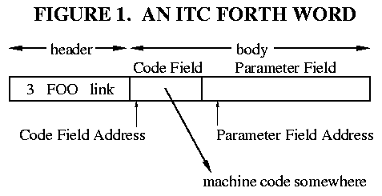

## MACHINE-CODE ACTIONS

Forth CONSTANTs are probably the simplest example of a machine- code
action. Let's consider some good Francophone constants

    1 CONSTANT UN
    2 CONSTANT DEUX
    3 CONSTANT TROIS

Executing the word UN will push the value 1 onto the Forth Parameter
Stack. Executing DEUX will push a 2 onto the stack, and so on. (Don't
confuse Parameter Stack with Parameter Field; they are entirely
separate.)

In the Forth kernel there is a single word called CONSTANT. This is
<span class="underline">not</span> a constant-type word itself; it is a
high-level Forth definition. CONSTANT is a "defining word": it creates
<span class="underline">new</span> words in the Forth dictionary. Here
we create the new "constant-type" words UN, DEUX, and TROIS. (You may
think of these as "instances" of the "class" CONSTANT.) These three
words will have their Code Fields pointing to a machine code fragment
that does the action of CONSTANT.

What must this code fragment do? Figure 2 shows the memory
representation of the three constants. All three words point to a common
action routine. The difference in the words is entirely contained in
their Parameter Fields, which, in this case, simply hold the constant
values ("instance variables" in object lingo). So, the action of these
three words should be <span class="underline">fetch the contents of the
Parameter Field, and push this onto the stack.</span> The code
understands implicitly that the parameter field contains a single-cell
value.

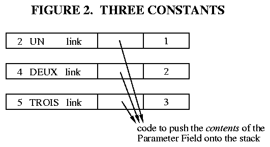

To write a machine-code fragment to do this, we need to know how to find
the Parameter Field Address, <span class="underline">after</span> the
Forth interepreter jumps to the machine code. That is, how is the PFA
passed to the machine-code routine? This, in turn, depends on how the
Forth interpreter NEXT has been coded, which varies from implementation
to implementation. <span class="underline">To write machine-code
actions, we must understand NEXT.</span>

The ITC NEXT was described in pseudo-code in Part 1. Here's one
implementation for the 6809, using Y=IP and X=W:

    NEXT:   LDX ,Y++    ; (IP) -> W, and IP+2 -> IP
            JMP [,X]    ; (W) -> temp, JMP (temp)

Suppose that we're in a high-level thread

``` 
   ... SWAP DEUX + ...   
```

with the Interpreter Pointer (IP) pointing to the DEUX "instruction,"
when NEXT is executed. (This would be at the very end of SWAP.) Figure 3
illustrates what happens. IP (register Y) is pointing within the
high-level thread, at a memory cell that contains the address of the
Forth word DEUX. To be precise, this cell contains the Code Field
Address of DEUX. So, when we fetch a cell using Y, and autoincrement Y,
we fetch the Code Field Address of DEUX. This goes into W (register X),
so W is now pointing to the Code Field. The
<span class="underline">contents</span> of this field is the address of
some machine code. We can fetch the contents of this cell and jump to
the machine code with a single 6809 instruction. This leaves register X
unchanged, so W is <span class="underline">still</span> pointing to the
CFA of DEUX. <span class="underline">This is how the Parameter Field
Address is obtained,</span> since, in this case, it is simply two bytes
past the Code Field.

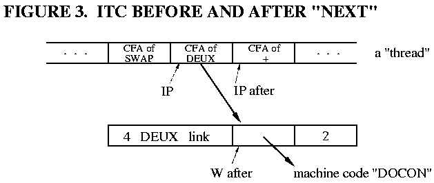

So, the machine code fragment has only to add 2 to W, fetch the cell
value at that address, and push that on the stack. This fragment is
frequently called DOCON:

    DOCON:  LDD 2,X  ; fetch the cell at W+2
            PSHU D   ; push that on the Parameter Stack
            NEXT     ; (macro) do the next high-level word

(For this example, TOS is kept in memory.) Note that the previous NEXT
incremented IP by 2, so it is already pointing to the next cell in the
thread ("CFA of +") when DOCON does NEXT.

In general, <span class="underline">ITC Forths leave the Parameter Field
Address or some "nearby" address in the W register.</span> In this case,
W contained the CFA, which in this Forth implementation is always PFA-2.
Since every class of Forth word except CODE words needs to use the
Parameter Field Address, many implementations of NEXT will increment W
to leave it pointing to the PFA. We can do this on the 6809 with one
small change:

    NEXT:  LDX ,Y++     ; (IP) -> W, and IP+2 -> IP
           JMP [,X++]   ; (W) -> temp, JMP (temp), W+2 -> W

This adds three clock cycles to NEXT, and leaves the Parameter Field
Address in W. What does it do to the Code Field routines?

``` 
        W=CFA           W=PFA

DOCON:  LDD 2,X (6)     LDD ,X (5)
        PSHU D          PSHU D
        NEXT            NEXT

DOVAR:  LEAX 2,X (5)    ; no operation
        PSHU X          PSHU X
        NEXT            NEXT

ENTER:  PSHS Y          PSHS Y
        LEAY 2,X (5)    LEAY ,X  (4, faster than TFR X,Y)
        NEXT            NEXT
```

In exchange for a three-cycle penalty in NEXT, the DOCON code is reduced
by one clock cycle, DOVAR by five cycles, and ENTER by one cycle. CODE
words don't use the value in W, so they gain nothing from the
autoincrement. The speed gained or lost is determined by the mix of
Forth words executed. The usual rule is that most of the words
<span class="underline">executed</span> are CODE words, thus,
incrementing W in NEXT costs a bit of speed overall. (There is a memory
savings, but DOCON, DOVAR, and ENTER appear only once, making this gain
slight.)

The best decision, of course, depends upon the processor. On machines
like the Z80, which only access memory by bytes and don't have
autoincrement address modes, it is often best to leave W pointing to
<span class="underline">IP+1</span> (the last byte fetched from the Code
Field). On other machines, autoincrementing is "free," and leaving W
pointing to the Parameter Field is most convienient.

Remember: the decision must be made
<span class="underline">consistently</span>. If NEXT leaves W pointing
to the PFA of the word being executed, then EXECUTE must do likewise\!
(This was the 'oops' that I corrected at the start of this article.)

### Direct Threading

Direct Threading works just like Indirect Threading, except that instead
of the Code Field containing the address of some machine code, it
contains a JUMP or CALL to some machine code. This makes the Code Field
larger -- e.g., 1 byte larger in the 6809 -- but removes one level of
indirection from the NEXT routine.

The choice of a JUMP or a CALL instruction in the Code Field hinges upon
<span class="underline">how the Parameter Field Address can be obtained
by the machine code routine.</span> In order to jump to the Code Field,
many CPUs require that its address be in a register. For instance, the
indirect jump on the 8086 is JMP AX (or some other register), and on the
Z80 is JP (HL) (or IX or IY). On these processors, the DTC NEXT involves
two operations, which on the 6809 would be:

    NEXT:  LDX ,Y++    ; (IP) -> W, and IP+2 -> IP
           JMP ,X      ; JMP (W)

(On the 8086, this can be done with LODSW, JMP AX.) The effect of this
is illustrated in Figure 4 as "case 1". The Code Field Address of DEUX
is fetched from the high-level thread, and IP is incremented. Then,
instead of a fetch, a JUMP is made to the Code Field Address (i.e., the
CPU jumps directly to the Code Field). The CFA is left in the W
register, just like the first ITC example above. Since this address is
already in a register, we can simply put a JUMP to DOCON in the Code
Field, and the DOCON fragment will work the same as before.

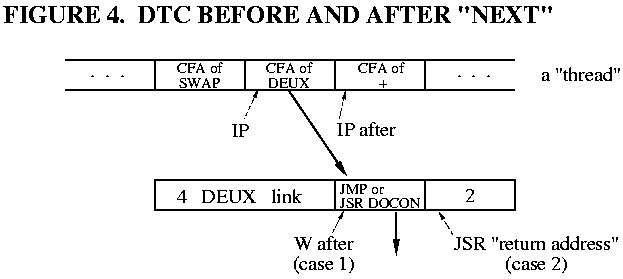

However, some processors -- such as the 6809 and PDP-11 -- can do this
DTC NEXT in <span class="underline">one</span> instruction:

    NEXT:  JMP [,Y++]   ; (IP) -> temp, IP+2 -> IP, JMP (temp)

This, too, will cause the CPU to jump to the Code Field of DEUX. But
there's one big difference: the CFA is not left in any register\! So how
is the machine code fragment to find the Parameter Field Address? By
putting a CALL (JSR) in the Code Field instead of a JUMP. On most CPUs,
the CALL instruction will push the return address -- the address
immediately following the CALL instruction -- onto the Return Stack. As
Figure 4 illustrates ("case 2"), this return address is exactly the
Parameter Field Address we want\! So, all DOCON has to do is pop the
Return Stack -- balancing the JSR in the Code Field -- and then use that
address to fetch the constant value. Thus:

    DOCON:  PULS X   ; pop the PFA from the Return Stack
            LDD ,X   ; fetch the Parameter Field cell
            PSHU D   ; push that on the Parameter Stack
            NEXT     ; (macro) do the next high-level word

Compare this with the ITC version. One instruction has been added to
DOCON, but one instruction has been deleted from NEXT. DOVAR and NEXT
likewise become one instruction longer:

    DOVAR:  PULS X   ; pop the PFA of the word
            PSHU X   ; push that address on the Parameter Stack
            NEXT
    
    ENTER:  PULS X   ; pop the PFA of the word
            PSHS Y   ; push the old IP
            TFR X,Y  ; the PFA becomes the new IP
            NEXT

Now go back to the beginning of this article, and reread my "oops," to
see why we can't just re-fetch the CFA by using the IP. Also note the
difference when the assignment of Forth's stack pointers to the 6809's U
and S is reversed.

### Subroutine Threading

Subroutine Threading (STC) is like DTC in that the CPU jumps directly to
the Code Field of a Forth word. Only now there is no NEXT code, no IP
register, and no W register. So, there is no choice but to use a JSR in
the Code Field, since this is the only way to obtain the Parameter Field
Address. This process is illustrated in Figure 5.

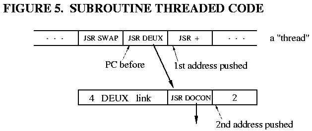

The high-level "thread" is a series of subroutine calls being executed
by the CPU. When the JSR DEUX is executed, the address of the next
instruction in the thread is pushed onto the Return Stack. Then, the JSR
DOCON within the word DEUX is executed, which causes
<span class="underline">another</span> return address -- the PFA of DEUX
-- to be pushed onto the Return Stack. DOCON can pop that address, use
it to fetch the constant, stack the constant, and then do an RTS to
return to the thread:

    DOCON:  PULS X  ; pop the PFA from the Return Stack
            LDD ,X  ; fetch the Parameter Field cell
            PSHU D  ; push that on the Parameter Stack
            RTS     ; do the next high-level word

We can still speak of a Code Field and a Parameter Field in
Subroutine-Threaded Code. In every "class" of Forth word
<span class="underline">except</span> CODE and colon defintions, the
Code Field is the space occupied by a JSR or CALL instruction (just like
DTC), and the Parameter Field is what follows. So, on the 6809, the PFA
would equal CFA+3. The meaning of "Parameter Field" becomes somewhat
fuzzy in CODE and colon definitions, as will be seen in future articles.

## THE SPECIAL CASE: CODE WORDS

There is a significant exception to all of the above generalizations.
This is CODE definitions -- Forth words that are defined as a machine
code subroutine. This wonderful capability is trivially easy to
implement in Forth, since every Forth word executes some piece of
machine code\!

The machine code comprising a CODE word is always contained in the body
of the Forth word. In an Indirect-Threaded Forth, the Code Field must
contain the address of the machine code to be executed. So the machine
code is placed in the Parameter Field, and the Code Field contains the
address of the Parameter Field, as shown in Figure 6.

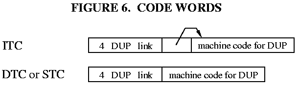

In Direct- and Subroutine-Threaded Forths, we could -- by analogy --
put, in the Code Field, a JUMP to the Parameter Field. But this would be
pointless, since the Parameter Field immediately follows the Code
Field\! The Code Field could be filled with NOPs for the same result.
Better still, the machine code could be started at the Code Field, and
continued into the Parameter Field. At this point the distinction of
"Code Field" and "Parameter Field" breaks down. This is no problem,
because we don't need this distinction for CODE words. (This does have
ramifications for decompilers and certain clever programming tricks,
none of which concern us here.)

CODE words -- whatever the implementation -- are the one case where the
machine code "action" routine does <span class="underline">not</span>
need to be passed the Parameter Field address. The Parameter Field
contains, not data, but the code being executed\! Only NEXT needs to
know this address (or the Code Field Address), so it can jump to the
machine code.

## USING ;CODE

Three questions remain unanswered:

a. how do we create a new Forth word that has some arbitrary data in its
Parameter Field?

b. how do we change the Code Field of that word, to point to some
machine code of our choosing?

c. how do we compile (assemble) this machine code fragment, which exists
in isolation from the words using it?

The answer to (a) is: we write a Forth word to do this. Since this word,
when executed, will define (create) a new word in the Forth dictionary,
it is called a "defining word." CONSTANT is one example of a defining
word. All of the "hard work" of a defining word is done by a kernel
word, CREATE, which parses a name from the input stream, builds the
header and Code Field for a new word, and links it into the dictionary.
(In fig-Forth this word is called \<BUILDS.) All that remains for the
programmer is to build the Parameter Field.

The answer to (b) and (c) is embodied in two convoluted words called
(;CODE) and ;CODE respectively. To understand how they work, let's look
at how the defining word CONSTANT is actually written in Forth. Using
the original ITC 6809 example:

    : CONSTANT ( n -- )
        CREATE      \ create the new word
        ,           \ append the TOS value to the dictionary,
                    \   as the 1st cell of the Parameter Field
        ;CODE       \ end high-level & start assembler code
        LDD 2,X     \ the code fragment DOCON
        PSHU D      \  "   "      "       "
        NEXT        \  "   "      "       "
    END-CODE

There are two parts to this Forth word. Everything from **: CONSTANT**
to **;CODE** is the high-level Forth code executed when the word
CONSTANT is invoked. Everything from **;CODE** to **END-CODE** is
machine code executed when the "children" of CONSTANT -- the
"constant-class" words such as UN and DEUX -- are executed. That is,
everything from ;CODE to END-CODE is the code fragment to which
constant-type words will point. The name ;CODE signifies that it ends a
high-level definition (";") and begins a machine- code definition
("CODE"). However, this is <span class="underline">not</span> put into
the dictionary as two separate words. Everything from **: CONSTANT** to
**END-CODE** is contained in the Parameter Field of CONSTANT, as shown
in Figure 7.

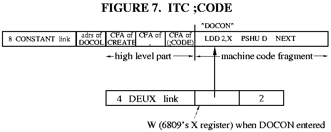

Derick and Baker \[DER82\] name three "sequences" that help to
understand the action of defining words:

<span class="underline">Sequence 1</span> is when the word CONSTANT is
being <span class="underline">defined</span>. This involves both the
high-level compiler (for the first part) and the Forth assembler (for
the second part). This is when the definition of CONSTANT shown in
Figure 7 is added to the dictionary. As we will see shortly, ;CODE -- a
compiler directive -- is executed during Sequence 1.

<span class="underline">Sequence 2</span> is when the word CONSTANT is
being <span class="underline">executed</span>, and when some
constant-type word is being defined. In the example

2 CONSTANT DEUX

Sequence 2 is when the word CONSTANT executes, and the word DEUX is
added to the dictionary (as shown in Figure 7). During Sequence 2, the
high-level part of CONSTANT is executed, including the word (;CODE).

<span class="underline">Sequence 3</span> is when the constant-type word
is executed. In our example, Sequence 3 is when DEUX is executed to push
the value 2 onto the stack. This is when the machine-code part of
CONSTANT is executed. (Recall that this fragment is the Code Field
action of DEUX.)

The words ;CODE and (;CODE) do the following:

**;CODE** is executed during Sequence 1, when CONSTANT is compiled. This
is an example of a Forth IMMEDIATE word -- a word executed during the
Forth compilation. ;CODE does three things:

a. it compiles the Forth word (;CODE) into CONSTANT,  
b. it turns off the Forth compiler, and  
c. it turns on the Forth assembler.

**(;CODE)** is part of the word CONSTANT, so it executes when CONSTANT
executes (Sequence 2). It performs the following actions:

a. It gets the address of the machine code that immediately follows.
This is done by popping IP from the Forth Return Stack.

b. It puts that address into the Code Field of the word just defined by
CREATE. The Forth word LAST (sometimes LATEST) gets the address of that
word.

c. It does the action of EXIT (a.k.a. ;S) so that the Forth inner
interpreter doesn't try to execute the machine code that follows as part
of the Forth thread. This is the high-level "subroutine return" which
ends a Forth thread.

F83 \[LAX84\] illustrates how these are typically coded in Forth:

    : ;CODE
        COMPILE (;CODE)     \ compiles (;CODE) into definition
        ?CSP  [COMPILE] [   \ turns off the Forth compiler
        REVEAL              \   (just like ";" does)
        ASSEMBLER           \ turns on the assembler
        ; IMMEDIATE         \ this is an IMMEDIATE word!
    
    : (;CODE)
        R>                  \ pops the adrs of the machine code
        LAST @ NAME>        \ gets the CFA of the latest word
        !                   \ stores the code address in the
        ;                   \   Code Field

(;CODE) is the more subtle of the two. Since it is a high-level Forth
definition, the address following it in the CONSTANT thread -- the
high-level "return address" -- is pushed onto Forth's Return Stack. So,
popping the Return Stack while within (;CODE) will yield the address of
the machine code that follows. Also, popping this value from the Return
Stack will "bypass" one level of high-level subroutine return, so that
when (;CODE) exits, it will exit to the
<span class="underline">caller</span> of CONSTANT. This is equivalent to
returning to CONSTANT, and then having CONSTANT return immediately. Use
Figure 7 and walk through the execution of the words CONSTANT and
(;CODE) to see how this works.

### Direct and Subroutine Threading

For DTC and STC, the action of ;CODE and (;CODE) is identical to ITC,
with one important exception: instead of holding an address, the Code
Field holds a JUMP or CALL instruction. For an absolute JUMP or CALL,
probably the only difference is that the address has to be stored at the
end of the Code Field, as the operand of the JUMP or CALL instruction.
In the case of the 6809, the address would be stored as the last two
bytes of the three-byte JSR instruction. But some Forths, such as Pygmy
Forth on the 8086, use a relative branch in the code field. In this
case, the relative offset must be computed and inserted into the branch
instruction.

## HIGH-LEVEL FORTH ACTIONS

We have seen how to make a Forth word execute a chosen fragment of
machine language code, and how to pass that fragment the address of the
word's Parameter Field. But how do we write the "action routine" in
high-level Forth?

Every Forth word <span class="underline">must</span> -- by the action of
NEXT -- execute some machine language routine. This is what the Code
Field is all about. Therefore, a machine language routine, or a set of
routines, is needed to handle the problems of invoking a high- level
action. We'll call this routine DODOES. There are three problems to be
solved:

a. how do we find the address of the high-level action routine
associated with this Forth word?

b. how do we, from machine code, invoke the Forth interpreter for a
high-level action routine?

c. how do we pass that routine the address of the Parameter Field for
the word we are executing?

The answer to (c) -- how do you pass an argument to a high-level Forth
routine -- is easy. On the Parameter Stack, of course. Our machine
language routine must push the Parameter Field Address on the stack
before it invokes the high level routine. (From our previous work, we
know how the machine language routine can obtain the PFA.)

The answer to (b) is a bit more difficult. Basically, we want to do
something like the Forth word EXECUTE, which invokes a Forth word; or
perhaps ENTER, which invokes a colon definition. Both are among our
"key" kernel words. The DODOES code will resemble these.

Question (a) is the tricky one. Where to put the address of the
high-level routine? Remember, the Code Field does
<span class="underline">not</span> point to high-level code; it must
point to machine code. Two approaches have been used in the past:

1\. **The fig-Forth solution.** Fig-Forth reserved the first cell of the
Parameter Field to hold the address of the high-level code. The DODOES
routine then obtained the Parameter Field address, pushed the address of
the actual data (typically PFA+2) onto the stack, fetched the address of
the high-level routine, and EXECUTEd.

There were two problems with this approach. First, the structure of the
Parameter Field was different for machine- code actions and high-level
actions. For example, a CONSTANT defined with a machine code action
would have its data stored at PFA, but a CONSTANT defined with a
high-level action would have its data stored at (typically) PFA+2.

Second, <span class="underline">every</span> instance of a
high-level-action class carried an additional overhead of one cell. That
is, if CONSTANT used a high-level action, every constant defined in the
program was one cell larger\!

Fortunately, clever Forth programmers quickly devised a solution which
overcame these problems, and the fig-Forth approach has fallen into
disuse.

**2. The modern solution.** Most Forths nowadays associate a
<span class="underline">different</span> machine language fragment with
<span class="underline">each</span> high-level action routine. So, a
high-level constant would have its Code Field pointing to a machine
language fragment whose sole function is to invoke the high-level action
of CONSTANT. A high-level variable's Code Field would point to the
"startup" routine for the high-level VARIABLE action, and so on.

Is this excessive duplication of code? No, because each of these
machine-language fragments is just a subroutine call to a common startup
routine, DODOES. (This is different from the fig-Forth DODOES routine.)
The address of the high-level code to DODOES is passed as an "inline"
subroutine parameter. That is, the address of the high-level code is put
immediately after the JSR/CALL instruction. DODOES can then pop the CPU
stack and do a fetch to obtain this address.

Actually, we make two more simplifications. The high-level code
<span class="underline">itself</span> is put immediately after the
JSR/CALL instruction. Then DODOES pops the CPU stack, and obtains this
address directly. And since we know this is high-level Forth code, we
dispense with its Code Field and just compile the high-level
thread...essentially incorporating the action of ENTER into DODOES.

Now each "defined" word just points to a bit of machine code...no space
is consumed in its Parameter Field. This bit of machine code is a JSR or
CALL instruction, followed by the high-level action routine. In the 6809
example, we have traded two bytes in
<span class="underline">every</span> constant for a three-byte JSR that
appears only <span class="underline">once.</span>

This is undoubtedly the most convoluted program logic in the entire
Forth kernel\! So, let's see how this is implemented in practice, using
our trusty ITC 6809 example.

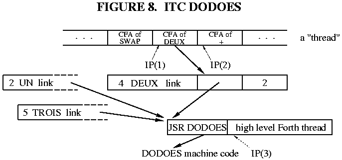

Figure 8 shows the constant DEUX implemented with a high-level action.
When the Forth interpreter encounters DEUX -- that is, when the Forth IP
is at IP(1) -- it does the usual thing: it fetches the address contained
in DEUX's Code Field, and jumps to that address. At that address is a
JSR DODOES instruction, so a second jump -- this time a subroutine call
-- is immediately taken. DODOES must then perform the following actions:

a. Push the address of DEUX's Parameter Field onto the Parameter Stack,
for later use by the high-level action routine. Since the JSR
instruction does not alter any registers, we expect to find the
Parameter Field Address of DEUX (or a "nearby" address) still in the W
register.

b. Obtain the address of the high-level action routine, by popping the
CPU stack. (Recall that popping the CPU stack will give the address of
whatever immediately follows the JSR instruction.) This is a high-level
<span class="underline">thread</span>, i.e., the Parameter Field part of
a colon definition.

c. Save the old value of Forth's Instruction Pointer -- IP(2) -- on
Forth's Return Stack, since the IP register will be used to execute the
high-level fragment. Essentially, DODOES must "nest" the IP, just like
ENTER does. Remember that Forth's Return Stack may not be the same as
the CPU subroutine stack.

d. Put the address of the high-level thread into IP. This is IP(3) in
Figure 8.

e. Do a NEXT to continue high-level interpretation at the new location.

Assume an indirect-threaded ITC 6809, and the following:

\* W is <span class="underline">not</span> incremented by NEXT (i.e., W
will contain the CFA of the word entered by NEXT);

\* the 6809 S is Forth's PSP, and U is Forth's RSP (i.e., the CPU stack
is <span class="underline">not</span> Forth's Return Stack);

\* the 6809 Y is Forth's IP, and X is Forth's W.

Recall the definition of NEXT for these conditions:

    NEXT:  LDX ,Y++   ; (IP) -> W, and IP+2 -> IP
           JMP [,X]   ; (W) -> temp, JMP (temp)

DODOES can be written as follows:

    DODOES: LEAX 2,X    ; make W point to the Parameter Field
            PSHU Y      ; (c) push old IP onto the Return Stack
            PULS Y      ; (b,d) pop new IP from the CPU stack
            PSHS X      ; (a) push W (the Parameter Field 
                        ;     Address) onto the Parameter Stack
            NEXT        ; (e) invoke high-level interpreter

These operations are slightly out of sequence. As long as the right
things go onto the right stacks (or into the right registers) at the
right time, the exact order of operations is not critical. In this case,
we're taking advantage of the fact that the old IP can be pushed onto
Forth's Return Stack before the new IP is popped from the CPU stack.

On some processors the CPU stack is used as Forth's Return Stack. In
this case, one step involving temporary storage is necessary. If we had
chosen S=RSP and U=PSP above, DODOES would be:

    DODOES: LEAX 2,X    ; make W point to the Parameter Field
            PSHU X      ; (a) push W (the Parameter Field 
                        ;     Address) onto the Parameter Stack
            PULS X      ; (b) pop thread address from CPU stack
            PSHS Y      ; (c) push old IP onto the Return Stack
            TFR X,Y     ; (d) put thread address into IP
            NEXT        ; (e) invoke high-level interpreter

Since we are essentially swapping the top of the Return/CPU stack with
IP, we need to use X as a temporary holding register. Thus we must push
the PFA -- step (a) -- before re-using the X register.

Walk through both of these DODOES examples step by step, and track the
contents of the registers and the two stacks. I
<span class="underline">always</span> walk through my DODOES routine,
just to make sure I'm not clobbering a register at the wrong time.

### Direct Threading

The logic of DODOES is the same in DTC Forths. But the implementation
may be different, depending on whether the DTC Forth uses a JMP or a
CALL in the Code Field of a word.

a. **JMP in Code Field.** A DTC Forth can use a JMP in the Code Field if
<span class="underline">the address of the word being executed is found
in a register.</span> This will most likely be the Code Field Address.

From the point of view of DODOES, this is identical to ITC. In our
example, DODOES sees that the Forth interpreter jumps to the machine
code associated with DEUX, and that code is a JSR to DODOES. It doesn't
matter that the first jump is now a direct jump rather than an indirect
jump; the register and stack contents are the same. So, the code for
DODOES will be identical to that for ITC. (Of course, NEXT is different,
and W may need a different offset to point to the Parameter Field.)

b. **CALL/JSR in Code Field.** In the DTC 6809, we never explicitly
fetch the CFA of the word being executed, so the Forth word must contain
a JSR in its Code Field. Instead of finding the Parameter Field Address
of the Forth word in a register, we find it on the CPU stack.

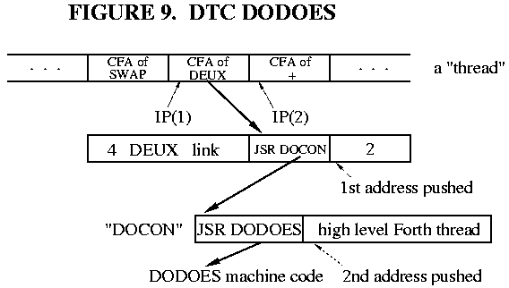

The DEUX example in this case is shown in Figure 9. When the Forth IP is
at IP(1), the Forth interpreter jumps to the Code Field of DEUX (and
increments IP). In the Code Field is a JSR to DEUX's machine code
fragment. At <span class="underline">that</span> address is a second
JSR, to DODOES. So <span class="underline">two</span> things get pushed
onto the CPU stack. The return address of the first JSR is the Parameter
Field address of DEUX. The return address of the second JSR -- and thus
topmost on the CPU stack -- is the address of the high- level thread to
be executed. DODOES must ensure that the old IP is pushed onto the
Return Stack, the PFA of DEUX is pushed onto the Parameter Stack, and
the address of the high-level thread is loaded into IP. This is very
sensitive to stack assignments\! For S=PSP (CPU stack) and U=RSP, the
NEXT and DODOES code is:

    NEXT: LDX [,Y++] ; (IP) -> temp, IP+2 -> IP, JMP (temp)
    
    DODOES: PSHU Y  ; push old IP onto the Return Stack
            PULS Y  ; pop new IP from the CPU stack
                    ; note: the CPU stack is the Parameter Stack, and the
                    ; topmost element is now the PFA of the word...
                    ; exactly what we want! 
            NEXT    ; invoke high-level interpreter

Check for yourself that the flow through NEXT, DEUX, and DODOES pushes a
net total of one item -- the PFA of DEUX -- onto the Parameter Stack\!

### Subroutine Threading

In STC Forths, there are no IP or W registers, and a high-level "thread"
is pure machine code (a series of subroutine calls). The only difference
between a high-level action and a ;CODE action is that the PFA of the
"defined" word must be pushed onto the Parameter Stack. "Defined" words
have a CALL/JSR in the Code Field, and the CPU stack must be Forth's
Return Stack, so DODOES is mostly a matter of stack manipulations.

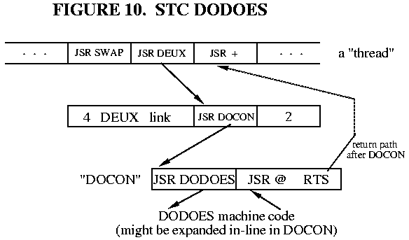

Figure 10 shows a 6809 STC example of DEUX with a high-level action. By
the time DODOES is entered, three things have been pushed onto the
CPU/Return Stack: the return address in the "main" thread, the PFA of
DEUX, and the address of DEUX's high- level action code. DODOES must pop
the last two, push the PFA onto the Parameter Stack, and jump to the
action code:

    DODOES: PULS X,Y    ; action code adrs -> X, PFA -> Y
            PSHU Y      ; push PFA onto Parameter Stack
            JMP ,X      ; jump to the action code

DODOES for the 6809 is now a three-instruction routine. It can be
simplified even further by "expanding JSR DODOES in-line," i.e.,
replacing the JSR DODOES with the equivalent machine code instructions.
Since there's one less JSR, this simplifies the stack manipulation to:

``` 
        PULS X      ; pop PFA from CPU stack
        PSHU X      ; and push it onto the Parameter Stack
        ...high level thread for DEUX...
```

This replaces a three-byte JSR with four bytes of explicit code, with a
considerable improvement in speed. For the 6809 this would probably be a
good choice. For a processor like the 8051, DODOES is long enough that
it should be kept as a subroutine.

## **USING DOES\>**

We learned with ;CODE how to create a new Forth word with arbitrary data
in its parameter field, and how to make that word's Code Field point to
a new machine code fragment. How do we compile a high-level action
routine, and make a new word point to it?

The answer lies in the two words DOES\> and (DOES\>), which are the
high-level equivalents of ;CODE and (;CODE). To understand them, let's
look at an example of their use:

    : CONSTANT ( n -- )
        CREATE      \ create the new word
        ,           \ append the TOS value to the dictionary,
                    \   as the 1st cell of the Parameter Field
        DOES>       \ end "create" part & start "action" part
        @           \ given the PFA, fetch its contents
        ;

Compare this with the previous ;CODE example, and observe that DOES\>
performs a function analogous to ;CODE. Everything from **: CONSTANT**
to **DOES\>** is executed when the word CONSTANT is invoked. This is the
code which builds the Parameter Field of the "defined" word. Everything
from **DOES\>** to **;** is the high-level code executed when the
"children" of CONSTANT (such as DEUX) are invoked, i.e., the high-level
fragment to which the Code Field will point. (We'll see that a JSR
DODOES is included before this high-level fragment.) Just as with ;CODE,
both the "create" and the "action" clauses are contained within the body
of the Forth word CONSTANT, as shown in Figure 11.

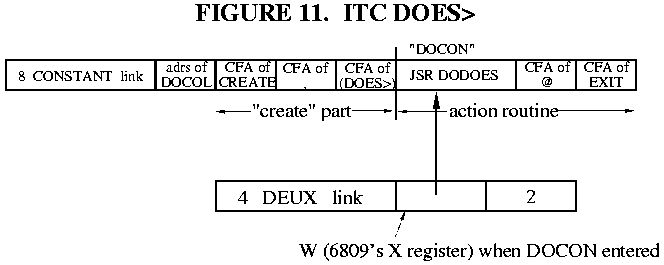

Recall Sequence 1, 2, and 3. The words DOES\> and (DOES\>) do the
following:

**DOES\>** is executed during Sequence 1, when CONSTANT is compiled.
Thus DOES\> is a Forth IMMEDIATE word. It does two things:

a. It compiles the Forth word (DOES\>) into CONSTANT.  
b. It compiles a JSR DODOES into CONSTANT.

Note that DOES\> leaves the Forth compiler running, in order to compile
the high-level fragment which follows. Also, even though JSR DODOES is
not itself Forth code, an IMMEDIATE word such as DOES\> can cause it to
be compiled in the middle of Forth code.

**(DOES\>)** is part of the word CONSTANT, so it executes when CONSTANT
executes (Sequence 2). It does the following:

a. It gets the address of the machine code that immediately follows (JSR
DODOES), by popping IP from the Forth Return Stack.

b. It puts that address into the Code Field of the word just defined by
CREATE.

c. It performs the action of EXIT, causing CONSTANT to terminate here
and not attempt to execute the fragment that follows.

The action of (DOES\>) is identical to (;CODE)\! A separate word is not
strictly required. F83, for example, uses (;CODE) in both ;CODE and
DOES\>. I'll use (;CODE) from now on instead of (DOES\>).

You've already seen the workings of (;CODE). The F83 definition of
DOES\> is

    : DOES>
        COMPILE (;CODE)     \ compiles (;CODE) into definition
        0E8 C,              \ the CALL opcode byte
        DODOES HERE 2+ - ,  \ the relative offset to DODOES
        ; IMMEDIATE

where DODOES is a constant which holds the address of the DODOES
routine. (The actual F83 source code is slightly different, due to the
requirements of the F83 metacompiler.) DOES\> need not fiddle with CSP
or the smudge bit, since the Forth compiler is left "on." In the case of
the 8086, the CALL instruction expects a relative address...hence the
arithmetic involving DODOES and HERE. In the 6809, DOES\> would look
like

    : DOES>
        COMPILE (;CODE)     \ compiles (;CODE) into definition
        0BD C,              \ the JSR Extended opcode byte
        DODOES ,            \ the operand: address of DODOES 
        ; IMMEDIATE

You can see here how the machine language JSR DODOES is compiled after
the high-level (;CODE), and before the high-level "action" code.

### Direct and Subroutine Threading

The only difference in DTC and STC is how the Code Field is fiddled to
point to a new routine. This is done by (;CODE), and the required
changes have already been described. DOES\> isn't affected at all,
unless you're writing an STC Forth and expanding the JSR DODOES to
explicit machine code. In this case, DOES\> is modified to assemble the
"in-line" machine code instead of a JSR DODOES instruction.

## ONWARD AND UPWARD

Who would have thought that so few lines of code would require so much
explanation? This is why I admire ;CODE and DOES\> so much...I've never
before seen seen such intricate, powerful, and flexible constructs coded
with such economy.

In the next installment I'll discuss the merits of assemblers vs.
metacompilers, and provide the actual CODE definitions for our Forth
example systems.

## REFERENCES

\[DER82\] Derick, Mitch and Baker, Linda, <span class="underline">Forth
Encyclopedia</span>, Mountain View Press (1982). A word-by-word
description of fig- Forth in minute detail. Still available from the
Forth Interest Group, P.O. Box 2154, Oakland CA 94621.

\[LAX84\] Laxen, H. and Perry, M., <span class="underline">F83 for the
IBM PC</span>, version 2.1.0 (1984). Distributed by the authors,
available from the Forth Interest Group or GEnie.

*Author's note for web publication: the files formerly available on the
GEnie online service are now available from the Forth Interest Group FTP
server, <ftp://ftp.forth.org/pub/Forth>.*

[Continue with Part 4](moving4.htm) | [Back to publications
page](index.html)

# MOVING FORTH

## Part 4: Assemble or Metacompile?

### by Brad Rodriguez

This article first appeared in [The Computer
Journal](http://www.psyber.com/~tcj) \#64 (November/December 1993).

"Keep it SHORT\!" was the editorial directive for this installment. So I
apologize for postponing the source listings to yet another issue. In
the meantime, there is a new decision to contemplate:

## **How do you build a Forth system for the Very First Time?**

You know now that most Forth code is high-level "threads," usually
compiled as just a series of addresses. In the early days of fig-Forth,
assemblers were often the only programming tools available. This was
fine for writing Forth CODE words, but high- level threads had to be
written as a series of DW directives. For example, the Forth word

``` 
 
: MAX ( n n - n)   OVER OVER < IF SWAP THEN DROP ;
```

would be written \[TAL80\]

``` 
      DW OVER,OVER,LESS,ZBRAN
      DW MAX2-$
      DW SWAP
MAX2: DW DROP,SEMIS
```

Later, as working Forth systems became widespread, Forthwrights began
modifying the Forth compilers into cross-compilers \[CAS80\]. Thus with
Forth on your CP/M machine (or Apple II, or whatever), you could write
Forth programs for some other CPU...up to and including an entirely new
Forth system for that CPU.

Because they create a new Forth from within Forth, these are often
called metacompilers. Computer science purists object to this, so some
Forthies use the terms "cross-compiler" and "recompiler." The difference
is that a recompiler can only generate a new Forth for the
<span class="underline">same</span> CPU.

Most PC Forths are now produced with metacompilers, but opinion is
divided in the embedded systems arena \[TIN91,ROD91,SER91\]. The
arguments for using assemblers to write Forth are:

1.  Metacompilers are cryptic and hard to understand, and you must
    thoroughly understand a metacompiler in order to use it.
2.  Assemblers are understood by the average programmer.
3.  An assembler is almost always available for a new CPU.
4.  Assemblers handle many optimizations (e.g. short vs. long branch).
5.  Assemblers handle forward references and peculiar address modes;
    many metacompilers don't.
6.  Assemblers use familiar editing and debugging tools.
7.  The code generation is completely visible -- nothing is "hidden"
    from the programmer.
8.  It's easier to tweak the Forth model, since many design decisions
    affect the internals of a metacompiler.

The arguments for metacompilers:

1.  You write "normal" looking Forth code, which is easier to read and
    debug.
2.  Once you understand your metacompiler, you can port it easily to new
    CPUs.
3.  The only tool you need to acquire is a Forth for your computer.

The last is particularly applicable to those who don't own PCs, since
most cross-assemblers require PCs or workstations these days.

I've written several Forths each way, so I'm painfully aware of the
tradeoffs. I admit a preference for metacompilers: I find the Forth code
for MAX much easier to read and understand than its assembler
equivalent. Most of the arguments against metacompilers have been
overcome by modern "professional" compilers, and if you're using Forth
for work I <span class="underline">strongly</span> recommend investing
in a commercial product. Alas, public-domain metacompilers (including my
own) are still behind the times, clunky, and arcane.

So I'm going to take a radical position for a Forth programmer, and tell
you to <span class="underline">choose for yourself</span>. I'll publish
the 6809 code in metacompiler form, and I'll supply a metacompiler for
F83 (IBM PC, CP/M, or Atari ST) \[ROD92\]. The Z80 code will be written
for a CP/M assembler. The 8051 code will be written for a public- domain
PC cross-assembler.

**Forth in C?**

No discussion of this topic would be complete without mentioning a new
trend: Forths written in C. These have the advantage of being more
portable than assembler -- in theory, all you have to do is recompile
the same source code for any CPU. The disadvantages:

1.  Less flexibility in the design decisions; e.g., direct-threaded code
    is probably not possible, and you can't optimize register
    assignments.
2.  You have to recompile the C source to add new primitives.
3.  Forth words carry the C call-and-return overhead.
4.  Some C Forths use inefficient threading techniques, e.g. a CASE
    statement.
5.  Most C compilers produce less efficient code than a good
    assembly-language programmer.

But for Unix systems and RISC workstations, which frown upon assembler,
this may be the only way to get a Forth up and running. The most
complete and widely used of the public-domain C Forths *\[at the time of
publication\]* is TILE (TILE\_21.ZIP, file \#2263 on GEnie's Forth
Roundtable). If you're not running Unix, you should look instead at the
Genie files HENCE4TH\_1.2.A (\#2490) and CFORTHU.ARC (\#2079).

To continue the previous comparison, here's the definition of MAX from
HENCE4TH \[MIS90\]. I omit the dictionary headers for clarity:

    _max() { 
        OVER  OVER  LESS IF  SWAP  ENDIF  DROP }

Instead of assembler, C is used to write the CODE words in the kernel.
For example, here is HENCE4TH's SWAP:

    _swap() { 
        register cell i = *(dsp);
        *(dsp) = *(dsp + 1);
        *(dsp + 1) = i;
    }

(Please note: there is quite a variety of techniques for writing Forth
words in C, so these words may appear radically different in CFORTH or
TILE.)

On a 68000 or SPARC, this might produce quite good code. On a Z80 or
8051, quite the opposite. But even if you plan to write a Forth in C,
you need to understand how Forth works in assembler. So stay tuned for
the next installment of Moving Forth\!

**REFERENCES**

\[CAS80\] Cassady, John J., <span class="underline">METAFORTH: A
Metacompiler for Fig- Forth</span>, Forth Interest Group (1980).

\[MIS90\] <span class="underline">HenceFORTH in C</span>, Version 1.2,
distributed by The Missing Link, 975 East Ave. Suite 112, Chico, CA
95926, USA (1990). This is a shareware product available from the GEnie
Forth Roundtable.

\[ROD91\] Rodriguez, B.J., letter to the editor, Forth Dimensions XIII:3
(Sep/Oct 1991), p.5.

\[ROD92\] Rodriguez, B.J., "Principles of Metacompilation," Forth
Dimensions XIV:3 (Sep/Oct 1992), XIV:4 (Nov/Dec 1992), and XIV:5
(Jan/Feb 1993). Note that the published code is for a fig-Forth variant
and not F83. The F83 version is on GEnie as CHROMIUM.ZIP

\[SER91\] Sergeant, Frank, "Metacompilation Made Easy," Forth Dimensions
XII:6 (Mar/Apr 1991).

\[TAL80\] Talbot, R.J., <span class="underline">fig-Forth for
6809</span>, Forth Interest Group, P.O. Box 2154, Oakland, CA 94621
(1980).

\[TIN91\] Ting, C.H., "How Metacompilation Stops the Growth Rate of
Forth Programmers," Forth Dimensions XIII:1 (May/Jun 1991), p.17.

*Author's note for web publication: the files formerly available on the
GEnie online service are now available from the Forth Interest Group FTP
server, <ftp://ftp.forth.org/pub/Forth>. Also, several new Forths-in-C
have been published since this article was first written. Consult the
"systems" FAQ at <ftp://ftp.forth.org/pub/Forth/FAQ> for a current
list.*

[Continue with Part 5](moving5.htm) | [Back to publications
page](index.html)

# MOVING FORTH

## Part 5: The Z80 Primitives

### by Brad Rodriguez

This article first appeared in [The Computer
Journal](http://www.psyber.com/~tcj) \#67 (May/June 1994).

## THE CODE I PROMISED

At long last, I am ready to present the complete source code for an (I
hope) ANSI compliant Forth, CamelForth\[1\]. As an intellectual exercise
-- and to ensure a clear copyright -- I've written this code entirely
from scratch. (Do you know how hard it is to *not* look at excellent
code examples?) Of course, my experience with various Forths has no
doubt influenced some design decisions.

Due to space limitations, the source code will be presented in four
installments (if you can't wait, complete files will be on GEnie):

1.  Z80 Forth "primitives," in assembler source
2.  8051 Forth "primitives," likewise
3.  Z80/8051 high-level kernel, likewise
4.  complete 6809 kernel, in metacompiler source

For CamelForth I'm trying to use exclusively public-domain tools: for
the Z80, the Z80MR assembler under CP/M \[3\]; for the 8051, the A51
cross-assembler on an IBM PC \[4\], and for the 6809, my own
metacompiler under F83 for CP/M, IBM PC, or Atari ST.

By "kernel" I mean the set of words that comprises a basic Forth system,
including compiler and interpreter. For CamelForth this is the ANS Forth
Core word set, plus any non-ANSI words necessary to implement the Core
word set. A Forth kernel is usually written partly in machine code (as
CODE words), and partly in high-level Forth. The words which are written
in machine code are called the "primitives," since, in the final
analysis, the entire Forth system is defined in terms of just these
words.

Exactly *which* words should be written in machine code? The selection
of the optimal set of primitives is an interesting debate. A smaller set
of primitives makes for easier porting, but poorer performance. I've
been told that a set of 13 primitives is sufficient to define all of
Forth -- a *very slow* Forth. eForth \[2\], designed for easy porting,
had a more generous set of 31 primitives. My rules are these:

1.  Fundamental arithmetic, logic, and memory operators are CODE.
2.  If a word *can't* be easily or efficiently written (or written at
    all) in terms of other Forth words, it should be CODE (e.g., U\<,
    RSHIFT).
3.  If a simple word is used frequently, CODE may be worthwhile (e.g.,
    NIP, TUCK).
4.  If a word requires fewer bytes when written in CODE, do so (a rule I
    learned from Charles Curley).
5.  If the processor includes instruction support for a word's function,
    put it in CODE (e.g. CMOVE or SCAN on a Z80 or 8086).
6.  If a word juggles many parameters on the stack, but has relatively
    simple logic, it may be better in CODE, where the parameters can be
    kept in registers.
7.  If the logic or control flow of a word is complex, it's probably
    better in high-level Forth.

For Z80 CamelForth I have a set of about 70 primitives. (See [Table
1](glosslo.txt).) Having already decided on the Forth model and CPU
usage (see my previous TCJ articles), I followed this development
procedure:

1.  Select the subset of the ANSI Core word set which will be
    primitives. (Subject to revision, of course.)
2.  From the ANSI descriptions, write assembler definitions of these
    words, plus the processor initialization code.
3.  Run this through the assembler, fixing source code errors.
4.  Test that you can produce working machine code. I usually add a few
    lines of assembler code to output a character once the
    initialization is complete. This seemingly trivial test is crucial\!
    It ensures that your hardware, assembler, "downloader" (EPROM
    emulator or whatever), and serial communications are all working\!
5.  (Embedded systems only.) Add another assembler code fragment to read
    the serial port and echo it back...thus testing *both* directions of
    communications.
6.  Write a *high-level* Forth fragment to output a character, using
    *only* Forth primitives. (Usually something like
    "LIT,33h,EMIT,BYE".) This tests the Forth register initialization,
    the stacks, and the threading mechanism. Problems at this stage can
    usually be traced to logic errors in NEXT or in the initialization,
    or data stack goofs (e.g. stack in ROM).
7.  Write a colon definition to output a character, and include it in
    the high-level fragment from step 6. (E.g., define BLIP as
    "LIT,34h,EMIT,EXIT" and then test the fragment "LIT,33h,EMIT,
    BLIP,BYE".) Problems at this stage are usually with DOCOLON or EXIT
    logic, or return stack goofs.
8.  At this point you can write some tools to help you with debugging,
    such as words to display in hex a number on the stack. [Listing
    1](cameltst.txt) shows a simple test routine to do a never-ending
    memory dump (useful even if your keyboard doesn't work). This tests
    the primitives DUP, EMIT, EXIT, C@, \>\<, LIT, 1+, and BRANCH, as
    well as several levels of nesting. Plus, it doesn't use DO..LOOP,
    which are often difficult to get working. When this code works, you
    have some confidence that your basic Forth model is valid.
9.  From here on it's just testing the remaining primitives -- DO..LOOP,
    UM/MOD, UM\*, and DODOES are particularly tricky -- and adding
    high-level definitions. I like to get a rudimentary interpreter
    going next, so that I can test words interactively.

With this set of primitives you can begin writing Forth code. Sure, you
have to use an assembler instead of a Forth compiler, but -- as [Listing
1](cameltst.txt) suggests -- you can use high-level control flow and
nesting to write useful code that would be more difficult to write in
assembler.

## READ THE CODE\!

I've run out of abstractions for today. If you want to learn more about
how a Forth kernel works and is written, study [Listing 2](camel80.txt).
It follows the Forth convention for documentation:

    WORD-NAME    stack in -- stack out    description

<span class="underline">WORD-NAME</span> is the name by which *Forth*
knows the word. Often these names include peculiar ASCII characters, so
an approximation must be used when defining assembler labels (such as
ONEPLUS for the Forth word 1+).

<span class="underline">stack in</span> are the arguments this word
expects to see on the stack, with the topmost stack item always on the
right. <span class="underline">stack out</span> are the arguments this
word will leave on the stack, likewise.

If the word has a return stack effect (other than nesting, that is), an
additional return stack comment will be added after "R:"

    stack in -- stack out    R: stack in -- stack out 

ANSI Forth defines a number of useful abbreviations for stack arguments,
such as "n" for a signed single-cell number, "u" for an unsigned
single-cell number, "c" for a character, and so on. See [Table
1](glosslo.txt).

## REFERENCES

\[1\] Definition of a camel: a horse designed by committee.

\[2\] Ting, C. H., <span class="underline">eForth Implementation
Guide</span>, July 1990, available from Offete Enterprises, 1306 South B
Stret, San Mateo, CA 94402 USA.

\[3\] Z80MR, a Z80 Macro Assembler by Mike Rubenstein, is public-domain,
available on the GEnie CP/M Roundtable as file Z80MR-A.LBR. Warning: do
*not* use the supplied Z1.COM program, use only Z80MR and LOAD. Z1 has a
problem with conditional jumps.

\[4\] A51, PseudoCorp's freeware Level 1 cross-assembler for the 8051,
is available from the Realtime and Control Forth Board, (303) 278-0364,
or on the GEnie Forth Roundtable as file A51.ZIP. PseudoCorp's
commercial products are advertised here in TCJ.

*Source code for Z80 CamelForth is available on this site at
<http://www.camelforth.com/public_ftp/cam80-12.zip>.*

[Continue with Part 6](moving6.htm) | [Back to publications
page](index.html)

# MOVING FORTH

## Part 6: the Z80 high-level kernel

### by Brad Rodriguez

This article first appeared in [The Computer
Journal](http://www.psyber.com/~tcj) \#69 (September/October 1994).

## ERRATA

There are two goofs in the CAMEL80.AZM file I presented in TCJ\#67. The
minor goof is that the name length specified in the HEAD macro for the
Forth word **\>** was incorrectly typed as 2 instead of 1.

The major goof results from a subtlety of CP/M console I/O. KEY must not
echo the typed character, and so used BDOS function 6. KEY? used BDOS
function 11 to test non-destructively for the presence of a keypress.
Unfortunately, BDOS function 6 does not "clear" the keypress detected by
function 11\! I have now rewritten KEY? to use BDOS function 6 (see
[Listing 1](camel80.txt)). Since this is a "destructive" test, I had to
add logic to save the "consumed" keypress and return it when KEY is next
used. This new logic can be used whenever your hardware (or operating
system) provides only a destructive test-for-keypress.

## HIGH LEVEL DEFINITIONS

In the last installment I did not expound greatly on the source code.
Each Forth "primitive" performs a miniscule, sharply-defined function.
It was almost all Z80 assembler code, and if it wasn't obvious *why* a
particular word was included, I hope it was clear *what* each word did.

In this installment I have no such luxury: I will present the high level
definitions which embody the elegant (and tortuous) logic of the Forth
language. Entire books have been written \[1,2,3\] describing Forth
kernels, and if you want complete mastery I highly recommend you buy one
of them. For TCJ I'll limit myself to some of the key words of the
compiler and interpreter, given in [Listing 2](camel80h.txt).

## TEXT INTERPRETER OPERATION

The text or "outer" interpreter is the Forth code which accepts input
from the keyboard and performs the desired Forth operations. (This is
distinct from the address or "inner" interpreter, NEXT, which executes
compiled threaded code.) The best way to understand it is to work
through the startup of the Forth system.

1\. The CP/M entry point (see [listing](camel80.txt) in previous
installment) determines the top of available memory, set the stack
pointers (PSP,RSP) and user pointer (UP), establishing the memory map
shown in [Figure 1](#FIGURE1). It then sets the "inner" interpreter
pointer (IP) to execute the Forth word **COLD**.

2\. **COLD** initializes the user variables from a startup table, and
then does **ABORT**. (**COLD** will also attempt to execute a Forth
command from the CP/M command line.)

3\. **ABORT** resets the parameter stack pointer and does **QUIT**.

4\. **QUIT** resets the return stack pointer, loop stack pointer, and
interpret state, and then begins to interpret Forth commands. (The name
is apt because **QUIT** can be used to abort an application and get back
to the "top level" of Forth. Unlike **ABORT**, **QUIT** will leave the
parameter stack contents alone.) **QUIT** is an infinite loop which will
**ACCEPT** a line from the keyboard, and then **INTERPRET** it as Forth
commands. When not compiling, **QUIT** will prompt "ok" after each line.

5\. **INTERPRET** is an almost verbatim translation of the algorithm
given in section 3.4 of the ANS Forth document. It parses one
space-delimited string from the input, and tries to **FIND** the Forth
word of that name. If the word is found, it will be either executed (if
it is an IMMEDIATE word, or if in the "interpret" state, STATE=0) or
compiled into the dictionary (if in the "compile" state, STATE\<\>0). If
not found, Forth attempts to convert the string as a number. If
successful, **LITERAL** will either place it on the parameter stack (if
in "interpret" state) or compile it as an in-line literal value (if in
"compile" state). If not a Forth word and not a valid number, the string
is typed, an error message is displayed, and the interpreter **ABORT**s.
This process is repeated, string by string, until the end of the input
line is reached.

## THE FORTH DICTIONARY

Whoa\! How does the interpreter "find" a Forth word by name? Answer:
Forth keeps a "dictionary" of the names of all Forth words. Each name is
connected in some fashion with the executable code for the corresponding
word.

There are many ways to store a set of strings for searching: a simple
array, a linked list, a multiple linked list, hash table, etc. Almost
all are valid here -- all Forth asks is that, if you reuse a name, the
*latest* definition is found when you search the dictionary.

It's also possible to have several sets of names ("vocabularies", or
"wordlists" in the new ANSI jargon ). This lets you reuse a name
*without* losing its previous meaning. For example, you could have an
integer **+**, a floating-point **+**, even a **+** for strings...one
way to achieve the "operator overloading" so beloved by the
object-oriented community.

Each string may be connected with its executable code by being
physically adjacent in memory -- i.e., the name appears in memory just
before the executable code, thus being called the "head" or "header" of
the Forth word. Or the strings may be located in a totally different
part of memory, and connected with pointers to executable code
("separate heads").

You can even have unnamed ("headless") fragments of Forth code, if you
*know* you'll never need to compile or interpret them. ANSI only
requires that the ANS Forth words be findable.

The design decisions could fill another article. Suffice it to say that
CamelForth uses the simplest scheme: a single linked list, with the
header located just before the executable code. No vocabularies...
although I may add them in a future issue of TCJ.

## HEADER STRUCTURE ([FIGURE 2](#FIGURE2))

Still more design decisions: what data should be present in the header,
and how should it be stored?

The minimum data is the name, precedence bit, and pointer (explicit or
implicit) to executable code. For simplicity, CamelForth stores the name
as a "counted string" (one byte of length, followed by N characters).
Early Forth Inc. products stored a length but only the first three
characters, for faster comparisons (the actual improvement gained is
another hot debate). Fig-Forth compromised, flagging the last character
with MSB high in order to allow either full-length or truncated names.
Other Forths have used packed strings \[4\], and I suspect even C-style
null-terminated strings have been used.

The "precedence bit" is a flag which indicates if this word has
IMMEDIATE status. IMMEDIATE words are executed *even during
compilation*, which is how Forth implements compiler directives and
control structres. There are other ways to distinguish compiler
directives -- Pygmy Forth \[5\], for example, puts them in a separate
vocabulary. But ANS Forth essentially mandates the use of a precedence
bit \[6\]. Many Forths store this bit in the "length" byte. I have
chosen to put it in a separate byte, in order to use the "normal" string
operators on word names (e.g. **S=** within **FIND**, and **TYPE**
within **WORDS**).

If the names are kept in a linked list, there must be a link. Usually
the latest word is at the head of the linked list, and the link points
to a previous word. This enforces the ANSI (and traditional) requirement
for redefined words. Charles Curley \[7\] has studied the placement of
the link field, and found that the compiler can be made significantly
faster if the link field comes *before* the name (rather than after, as
was done in Fig-Forth).

[Figure 2](#FIGURE2) shows the structure of the CamelForth word header,
and the Fig-Forth, F83, and Pygmy Forth headers for comparison. The
"view" vield of F83 and Pygmy is an example of other useful information
which can be stored in the Forth word header.

Remember: it's important to distinguish the header from the "body"
(executable part) of the word. They need not be stored together. The
header is only used during compilation and interpretation, and a "purely
executable" Forth application could dispense with headers entirely.
However, headers must be present -- at least for the ANSI word set --
for it to be a legal ANS Forth System.

When "compiling" a Forth system from assembler source code, you can
define macros to build this header (see HEAD and IMMED in CAMEL80.AZM).
In the Forth environment the header, *and the Code Field*, is
constructed by the word **CREATE**.

## COMPILER OPERATION

We now know enough to understand the Forth compiler. The word **:**
starts a new high-level definition, by creating a header for the word
(**CREATE**), changing its Code Field to "docolon" (**\!COLON**), and
switching to compile state (**\]**). Recall that, in compile state,
every word encountered by the text interpreter is compiled into the
dictionary instead of being executed. This will continue until the word
**;** is encountered. Being an IMMEDIATE word, **;** will execute,
compiling an **EXIT** to end the definition, and then switching back to
interpret state (**\[**).

Also, **:** will **HIDE** the new word, and **;** will **REVEAL** it (by
setting and clearing the "smudge" bit in the name). This is to allow a
Forth word to be redefined in terms of its "prior self". To force a
recursive call to the word being defined, use **RECURSE**.

Thus we see that there is no distinct Forth "compiler", in the same
sense that we would speak of a C or Pascal compiler. The Forth compiler
is embodied in the actions of various Forth words. This makes it easy
for you to change or extend the compiler, but makes it difficult to
create a Forth application *without* a built-in compiler\!

## THE DEPENDENCY WORD SET

Most of the remaining high-level words are either a) necessary to
implement the compiler and interpreter, or b) provided solely for your
programming pleasure. But there is one set which deserves special
mention: the words I have separated into the file CAMEL80D.AZM ([Listing
3](camel80d.txt)).

One of the goals of the ANSI Forth Standard was to hide CPU and model
dependencies (Direct or Indirect Threaded? 16 or 32 bit?) from the
application programmer. Several words were added to the Standard for
this purpose. I have taken this one step further, attempting to
encapsulate these dependencies *even within the kernel*. Ideally, the
high-level Forth code in the file CAMEL80H.AZM should be the same for
all CamelForth targets (although different assemblers will have
different syntax).

Differences in cell size and word alignment are managed by the ANS Forth
words **ALIGN ALIGNED CELL+ CELLS CHAR+ CHARS** and my own addition,
**CELL** (equivalent to **1 CELLS**, but smaller when compiled).

The words **COMPILE, \!CF ,CF \!COLON** and **,EXIT** hide peculiarities
of the threading model, such as a) how are the threads represented, and
b) how is the Code Field implemented? The value of these words becomes
evident when you look at the differences between the direct-threaded Z80
and the subroutine-threaded 8051:

``` 
 
 word     compiles on Z80   compiles on 8051

 COMPILE, address           LCALL address
 !CF      CALL address      LCALL address
 ,CF      !CF & allot       3 bytes !CF & allot 3 bytes
 !COLON   CALL docolon      nothing!
 ,EXIT    address of EXIT   RET
```

(**\!CF** and **,CF** are different for indirect-threaded Forths.)

In similar fashion, the words **,BRANCH ,DEST** and **\!DEST** hide the
implementation of high-level branch and loop operators. I have tried to
invent -- without borrowing from existing Forths\! -- the minimal set of
operators which can factor out all the implementation differences. Only
time, expert criticism, and many CamelForths will tell how successful
I've been.

So far I have *not* been successful factoring the differences in header
structure into a similar set of words. The words **FIND** and **CREATE**
are so intimately involved with the header contents that I haven't yet
found suitable subfactors. I have made a start, with the words
**NFA\>LFA NFA\>CFA IMMED? HIDE REVEAL** and the ANS Forth words
**\>BODY IMMEDIATE**. I'll continue to work on this. Fortunately, it is
practical for the time being to use the identical header structure on
all CamelForth implementations (since they're all byte-addressed 16-bit
Forths).

## NEXT TIME...

I will probably present the 8051 kernel, and talk about how the Forth
compiler and interpreter are modified for Harvard architectures
(computers that have logically distinct memories for Code and Data, like
the 8051). For the 8051 I will print the files CAMEL51 and CAMEL51D, but
probably only excerpts from CAMEL51H, since (except for formatting of
the assembler file) the high-level code shouldn't be different from what
I've presented this issue...and Bill needs the space for other
articles\! Don't worry, the full code will be uploaded to GEnie.

*However,* I may succumb to demands of Scroungemaster II builders, and
publish the 6809 CamelForth configured for the Scroungemaster II board.
Whichever I do next, I'll do the other just one installment later.

## REFERENCES

1\. Derick, Mitch and Baker, Linda, <span class="underline">Forth
Encyclopedia</span>, Mountain View Press, Route 2 Box 429, La Honda, CA
94020 USA (1982). Word-by-word description of Fig-Forth.

2\. Ting, C. H., <span class="underline">Systems Guide to
fig-Forth</span>, Offete Enterprises, 1306 South B Street, San Mateo, CA
94402 USA (1981).

3\. Ting, C. H., <span class="underline">Inside F83</span>, Offete
Enterprises (1986).

4\. Ewing, Martin S., <span class="underline">The Caltech Forth
Manual</span>, a Technical Report of the Owens Valley Radio Observatory
(1978). This PDP-11 Forth stored a length, four characters, and a link
in two 16-bit words.

5\. Sergeant, Frank, <span class="underline">Pygmy Forth for the IBM
PC</span>, version 1.4 (1992). Distributed by the author, available from
the Forth Interest Group (P.O. Box 2154, Oakland CA 94621 USA) or on
GEnie.

6\. J. E. Thomas examined this issue thoroughly when converting Pygmy
Forth to an ANSI Forth. No matter what tricks you play with relinking
words, strict ANSI compliance is violated. A regrettable decision on the
part of the ANS Forth team.

7\. In private communication.

The source code for Z80 CamelForth is *now* available on GEnie as
CAMEL80.ARC in the CP/M and Forth Roundtables. Really. I just uploaded
it. (Apologies to those who have been waiting.)

*Source code for Z80 CamelForth is available on this site at
<http://www.camelforth.com/public_ftp/cam80-12.zip>.*

## <span id="FIGURE1"></span>FIGURE 1. Z80 CP/M CAMELFORTH MEMORY MAP

assuming CP/M BDOS starts at ED00 hex.

    0000 +-----------------------+
         |      CP/M stuff       |
    0080 +-----------------------+
         | Terminal Input Buffer |
         |                       |
    0100 +-----------------------+
         |                       |
         | CamelForth Z80 kernel |
         |                       |
    1700 +-----------------------+
         | User definitions      |
         |                       |
         |                       |   / EB00 reserved     
         ~~~~~~~~~~~~~~~~~~~~~~~~~  /  EB02 >IN          
         |                       | /   EB04 BASE         
    EB00 +-----------------------+/    EB06 STATE        
         | User Area             |     EB08 DP           
         |                       |\    EB0A,EB0C 'SOURCE
         |                       | \   EB0E LATEST       
         |       Parameter Stack |  \  EB10 HP           
    EC00 +-----------------------+   \ EB12 LP           
         |                       |
         |   HOLD working buffer |
    EC28 +-----------------------+
         | PAD buffer            |
         |                       |
    EC80 +-----------------------+
         | Leave stack*          |
         |                       |
         |                       |
         |          Return stack |
    ED00 +-----------------------+
         |                       |
         |         CP/M          |
         |                       |
    FFFF +-----------------------+

\* used during compilation of DO..LOOPs.

## <span id="FIGURE2"></span>FIGURE 2. HEADER STRUCTURES

``` 
    CamelForth        Fig-Forth          Pygmy Forth            F83
                                                        
 D7           D0    D7           D0    D7           D0    D7           D0
+---------------+  +-+-+-+---------+  +---------------+  +---------------+
|               |  |1|P|S| length  |  |               |  |               |
|-    link     -|  +-+-+-+---------+  |-    view     -|  |-    view     -|
|               |  |               |  |               |  |               |
+-------------+-+  |-    name     -|  +---------------+  +---------------+
|      0      |P|  |               |  |               |  |               |
+-+-----------+-+  ~~~~~~~~~~~~~~~~~  |-    link     -|  |-    link     -|
|S|   length    |  |               |  |               |  |               |
+-+-------------+  +-+            -|  +-+-+-+---------+  +-+-+-+---------+
|               |  |1|             |  |0|0|S| length  |  |1|P|S| length  |
|-    name     -|  +-+-------------+  +-+-+-+---------+  +-+-+-+---------+
|               |  |               |  |               |  |               |
~~~~~~~~~~~~~~~~~  |-    link     -|  |-    name     -|  |-    name     -|
|               |  |               |  |               |  |               |
|-             -|  +---------------+  ~~~~~~~~~~~~~~~~~  ~~~~~~~~~~~~~~~~~
|               |                     |               |  |               |
+---------------+                     |-             -|  +-+            -|
                                      |               |  |1|             |
                                      +---------------+  +-+-------------+
```

**Link** - in CamelForth and Fig-Forth, points to the previous word's
Length byte. In Pygmy Forth and F83, points to the previous word's Link.

**P** - Precedence bit, equals 1 for an IMMEDIATE word (not used in
Pygmy).

**S** - Smudge bit, used to prevent FIND from finding this word.

**1** - in Fig-Forth and F83, the length byte and the last character of
the name are flagged with a 1 in the most significant bit (bit 7).

**View** - in Pygmy Forth and F83, contains the block number of the
source code for this word.

[Continue with Part 7](moving7.htm) | [Back to publications
page](index.html)

# MOVING FORTH

## Part 7: CamelForth for the 8051

### by Brad Rodriguez

This article first appeared in [The Computer
Journal](http://www.psyber.com/~tcj) \#71 (January/February 1995).

Under the prodding of Our Esteemed Editor, I present CamelForth for the
8051. CamelForth for the 6809 will follow soon\! This 8051 Forth
occupies about 6K of program memory. Alas, the full source listing would
take 16 pages of TCJ, so this article includes only the significantly
changed portions of the kernel. *\[Note for web publication: see the end
of this page for a link to the 8051 source code.\]* These should
illustrate how the high-level code is modified for the 8051 assembler,
and for subroutine threading. The full source code is available in the
Forth Roundtable on GEnie as file CAMEL51.ZIP, and the freeware 8051
assembler as file A51.ZIP. But first...

## Z80 ERRATA

In the file CAMEL80H.AZM, the definition of DO is given as

``` 
  ['] xdo ,BRANCH  . . . 
```

It should be

``` 
  ['] xdo ,XT  . . . 
```

This is of no consequence on the Z80 (where ,BRANCH and ,XT are
identical), but it became embarassingly obvious on the 8051.

Also, in the words S" and (S"), the word ALIGN should really be ALIGNED.
On the Z80 -- and the 8051 -- both are no-ops, so this mistake didn't
make itself evident.

## 8051 CAMELFORTH MODEL

In issue \#60 I summarized the design decisions for an 8051 Forth. To
recap: the 8051's retarded memory addressing practically demands the use
of subroutine threading. This means the hardware stack (in the 8051
register file) is the Return Stack. The Parameter Stack (a.k.a. Data
Stack) is in 256 bytes of external RAM, using R0 as the stack pointer.
Since that article, I've discovered that it's better to keep the Top Of
Stack item (TOS) in DPTR than in R3:R2. Thus:

<table>
<thead>
<tr class="header">
<th>reg adrs</th>
<th>8051 name</th>
<th>Forth usage</th>
</tr>
</thead>
<tbody>
<tr class="odd">
<td>0</td>
<td>R0</td>
<td>low byte of PSP (Parameter Stack Pointer)</td>
</tr>
<tr class="even">
<td>1-5</td>
<td>R1-R5</td>
<td>scratch registers for Forth</td>
</tr>
<tr class="odd">
<td>6-7</td>
<td>R6-R7</td>
<td>loop index</td>
</tr>
<tr class="even">
<td>8</td>
<td><br />
</td>
<td>high byte of PSP and UP (also output on P2)</td>
</tr>
<tr class="odd">
<td>9-7Fh</td>
<td><br />
</td>
<td>119 bytes of return stack (more on 8052s!)</td>
</tr>
<tr class="even">
<td>81h</td>
<td>SP</td>
<td>low byte of RSP (Return Stack Pointer)</td>
</tr>
<tr class="odd">
<td>82-83h</td>
<td>DPTR</td>
<td>Top-Of-Stack item</td>
</tr>
<tr class="even">
<td>E0,F0h</td>
<td>A,B</td>
<td>scratch registers for Forth</td>
</tr>
</tbody>
</table>

This incorporates an idea from Charles Curley \[CUR93\]. On a
register-rich machine like the 8051, we can keep the innermost loop
index in registers. This makes LOOP and +LOOP much faster. DO must still
push two values on the Return Stack: the *old* loop index, and the *new*
loop limit\! UNLOOP must of course restore the loop index from the
Return Stack -- kudos to the ANSI team for making UNLOOP a distinct
word\! Note that R6:R7 are *not* the topmost Return Stack item, merely
the innermost loop index.

Port 2 (P2) contains the high byte of the Parameter Stack Pointer
(allowing R0 to address external memory), which is also the high byte of
the User Pointer -- the low byte of UP is assumed to be 00. I learned
the hard way that P2 can't be read while executing from external ROM, so
I keep a copy of the P2 byte in register 8.

I have a novel implementation of BRANCH and ?BRANCH. Since the 8051
model is subroutine-threaded, high-level Forth is compiled as true
machine code. So BRANCH can be implemented with an SJMP (or AJMP or
LJMP) instruction. ?BRANCH can be implemented with a JZ instruction,
*if* the zero/nonzero status of the top-of-stack is put in the
accumulator (A register). The subroutine ZEROSENSE does this. So, BRANCH
and ?BRANCH become

    BRANCH:   SJMP dest 
    ?BRANCH:  LCALL ZEROSENSE JZ dest 

Similar routines LOOPSENSE and PLUSLOOPSENSE allow a JZ instruction to
be used for LOOP and +LOOP. For these, a call to UNLOOP must appear
after the JZ, to clean up the Return Stack when the program "falls out"
of the loop.

In the assembly language source file I have manually replaced the
sequence

``` 
  LCALL word   RET 
```

with the shorter and faster

``` 
  LJMP word 
```

in many places \[CUR93\]. This works as long as "word" isn't a
return-stack operator (such as R\> or \>R). LCALL and LJMP have also
been replaced with ACALL and AJMP where possible. The CamelForth
compiler does *not* attempt these optimizations.

I wrote the 8051 kernel to use "Intel" byte order (low byte first). Then
I discovered that the address compiled into an LJMP or LCALL is stored
*high* byte first. Rather than rewrite the entire kernel, I included a
byte-swap in those words which compile LCALLs: COMPILE, \!CF and ,CF
(all in the Dependency word set).

Listing 1 gives the 8051 assembly language "primitives", and Listing 2
gives the Dependency word set.

## HARVARD ARCHITECTURES

The 8051 uses a "Harvard" architecture: program and data are kept in
separate memories. In embedded systems, these are typically ROM and RAM,
respectively. ANS Forth is the first Forth standard to address the
restrictions of a Harvard architecture. Briefly, ANS Forth says that a)
application programs can only access Data memory, and b) all of the
operators used to access memory and build data structures must operate
in Data space. (Ref. section 3.3.3 of the ANS document \[ANS94\].) This
includes the Forth words

@ \! C@ C\! DP HERE ALLOT , C, COUNT TYPE WORD (S") S" CMOVE

Yet the Forth compiler still needs to access Program space (also called
Code or Instruction space). And Forth needs to maintain a dictionary
pointer for Program space as well as Data space. So I've added these new
words (shown in Listing 3):

I@ I\! IC@ IC\! IDP IHERE IALLOT I, IC, ICOUNT ITYPE IWORD (IS") IS"
D-\>I I-\>D

The "I" prefix stands for "Instruction" (since "P" and "C" have other
meanings in Forth). ICOUNT and ITYPE are needed to display strings which
have been compiled into ROM. IWORD copies the string left by WORD from
Data space to Code space -- needed to build Forth word headers and
ROMmed strings. D-\>I and I-\>D are equivalents of CMOVE, which copy to
and from Code space.

VARIABLEs must have addresses in Data space. So they can't use the
traditional practice of putting the data immediately after the Code
field. Instead, the *Data space address* of the data is stored after the
Code field. In essence, a VARIABLE is a CONSTANT whose value is the Data
space address. (Note that the traditional CONSTANT is still valid.)

CREATEd words, and words built with CREATE...DOES\>, must work the same
way. Here's how they look in Program space:

    CODE word:   ...header... 8051 machine code 
    high-level:  ...header... 8051 machine code 
    CONSTANT:    ...header... LCALL-DOCON  value 
    VARIABLE:    ...header... LCALL-DOCON  Data-adrs 
    CREATEd:     ...header... LCALL-DOCON  Data-adrs 

Note that CONSTANT must replace the value stored by CREATE, and : must
"un-allot" both this value and the LCALL DOCON.

S" presents special problems. Strings defined with S" ("text literals")
must reside in Data space, where they can be used by such words as TYPE
and EVALUATE. But we expect those strings to be part of a definition,
and to exist in ROM in a ROM forth environment. We could store the
string in Program space, and copy it to HERE when referenced, but the
ANS document does not allow text literals to exist in this "transient"
storage region (ref. sections 3.3.3.4 and 3.3.3.6 \[ANS93\]). Also, if
WORD returns its string at HERE -- as in CamelForth -- text literals
must not alter this transient region.

My solution is to have S" *store* the string in Code space, but
permanently reserve space for it in Data space, and copy it from Code to
Data when referenced. ANS Forth does not yet fully address the problems
of Harvard processors; something like C's "initialized data" region may
eventually be required.

Since ." strings can never be accessed by the programmer, they *can* be
stored in Code space, using the words (IS") and IS". (These are the
"old" (S") and S".) This adds two words to the kernel, but saves quite a
bit of Data space. I plan to move the string-literal words into either
the Dependency word set, or a new "Harvard" word set.

## WRITING TO PROGRAM SPACE

The 8051 can't actually write to Program memory. There's no hardware
signal for this, and no machine instruction. Under these circumstances,
the CamelForth *interpreter* will work, but new words can't be compiled.
You can get around this by causing some memory to appear in *both*
Program and Data space. Figure 1 shows the modification to my board, an
MCB8031 from Blue Ridge Micros (2505 Plymouth Road, Johnson City, TN,
37601, USA, telephone 615-335-6696, fax 615-929-3164). U1A and U1B
create a new read strobe which is active for *either* a Program or Data
fetch. EPROM is selected only when A15 is low (lower 32K), and RAM when
A15 is high (upper 32K). You still can't write to EPROM, of course, but
you *can* execute programs out of RAM\! One disadvantage: this makes @
and I@ equivalent, so it's not immediately obvious if the wrong one was
used somewhere.

### Figure 1

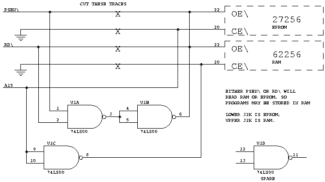

## NEXT ISSUE...

These modifications to the CamelForth high-level code are intended to be
portable to *either* Harvard or non-Harvard ("von Neumann") machines.
For the latter, the new Program-space words are simply equated to their
Data-space equivalents, e.g. on the Z80,

IFETCH EQU FETCH  
ISTORE EQU STORE  
ITYPE EQU TYPE  
etc.

In the next installment I shall modify the *8051* source code to work on
the 6809...thus approaching a truly portable model by successive
approximation.

## REFERENCES

\[ANS93\] <span class="underline">dpANS-6 draft proposed American
National Standard for Information Systems - Programming Languages -
Forth</span>, June 30, 1993. "It is distributed solely for the purpose
of review and comment and should not be used as a design document. It is
inappropriate to claim compatibility with this draft standard."
Nevertheless, for the last 16 months it's all we've had to go by.

\[CUR93\] Curley, Charles, <span class="underline">Optimization
Considerations</span>, Forth Dimensions XIV:5 (Jan/Feb 1993), pp. 6-12.

*Source code for 8051 CamelForth is available on this site at
[http://www.camelforth.com/public\_ftp/cam51-15.zip](http://www.camelforth.com/public_ftp/cam80-12.zip).*

[Continue with Part 8](moving8.htm) | [Back to publications
page](index.html)

# MOVING FORTH

## Part 8: CamelForth for the 6809

### by Brad Rodriguez

This article first appeared in [The Computer
Journal](http://www.psyber.com/~tcj) \#74 (July/August 1995).

Finally, the last installment of "Moving Forth\!" Here is the long-
promised ANSI CamelForth for the Motorola 6809, and specifically for the
Scroungmaster II processor board.

Unlike the Z80 and 8051 CamelForth, the 6809 Forth was produced with my
"Chromium 2" Forth metacompiler \[ROD92\]. Right away you'll notice two
things: first, the metacompiler runs on an older Forth (F83), and so the
source code is contained in 16x64 Forth "screens". I've converted these
to an ASCII file for TCJ, but the original formatting is still evident.

Second, source code for a Forth metacompiler looks like ordinary Forth
code (with a few changes, which I'll discuss shortly). Thus the
definition of **1+** is given as

``` 
  CODE 1+   1 # ADDD,   NEXT   ;C  
```

The assembler used is the 6809 assembler I've described previously in
TCJ \[ROD91\].

I typed the [high-level source code](camel09.txt) directly from the
already-published listings (converting to the Forth syntax in the
process). Unfortunately, this was done over the space of a few days, and
sometimes I worked from the Z80 listing, and sometimes the 8051...with
the result that the Harvard-architecture constructs (such as I@ and
IALLOT) are not consistently used in the 6809 code. This is of no
consequence for the non-Harvard 6809, but I'll have to correct this
before porting the Forth code to a Harvard CPU.

Also, since I was working from published listings, I often neglected
typing the detailed comments for the high-level words. For this I
apologize. You can find how any word works by consulting the previous
listings, but I shouldn't force you to do this.

## [6809 CAMELFORTH SOURCE CODE](camel09.txt)

The 6809 CamelForth model holds top-of-stack in D, and uses the S stack
pointer for the Parameter Stack. The U stack pointer is the Return Stack
Pointer, and Y is the Interpreter Pointer. X is the temporary register
"W". The 6809 direct page pointer DPR holds the high byte of the User
Pointer (the low byte is assumed to be zero).

The memory map for a Scroungemaster II with 8K of RAM and 8K of EPROM is
as follows:

``` 
 6000-797Fh RAM dictionary (for new definitions)
 7980-79FFh Terminal Input Buffer
 7A00-7A7Fh User Area (USER variables)
 7A80-7AFFh Parameter Stack (grows downward)
 7B00-7B27h HOLD area (grows downward) 
 7B28-7B7Fh PAD area (general purpose buffer)
 7B80-7BFFh Return Stack (grows downward)

 E000-FFFFh Forth kernel in EPROM
```

All of the RAM data areas are referenced to the User Pointer, whose
starting value is given by UP-INIT: in this case, 7A00h. (Note the use
of UP-INIT-HI for the high byte of this value.) When CamelForth starts,
it will set its Dictionary Pointer to DP-INIT, which must be in RAM so
you can add new definitions to the Forth dictionary. These are all
specified with the metacompiler's EQU directive. An EQU is like a
CONSTANT, except that it is *only* known to the metacompiler. These
EQUates take up no space in the 6809 kernel, and will not appear in the
6809 Forth's dictionary.

DICTIONARY tells the metacompiler where to compile the code, in this
case for an 8K EPROM from E000-FFFFh. The new dictionary is named "ROM",
and then ROM is specified to select that dictionary. (If you're familiar
with Forth vocabularies, you'll see a strong resemblance.)

AKA ("also known as") defines a synonym for a Forth word. Since the 6809
is a non-Harvard machine, we should compile @ wherever I@ appears in the
source code, and likewise for the other "I-prefix" (instruction-space)
words. AKA will do this. These synonyms are like EQUates -- they don't
appear in the 6809 dictionary.

The metacompiler allows you to use forward references, i.e., Forth words
which haven't been defined yet. (You must of course define them before
you finish\!) Often this is automatic, but AKA requires you to
explicitly declare a forward reference with PRESUME. Thus

``` 
  PRESUME WORD   AKA WORD IWORD   
```

is needed to create the IWORD synonym. @ \! HERE ALLOT and the others
are PRESUMEd by the metacompiler, so we don't have to do so here.

The CODE definitions are conventional. Note that you can use

``` 
  HERE EQU labelname  
```

to generate a label when metacompiling. (This is a function of the
metacompiler, not the assembler.) Also, ASM: begins a "fragment" of
assembler code (i.e., not part of a CODE word).

The phrase

``` 
  HERE RESOLVES name 
```

is used to resolve certain forward references which are made by the
metacompiler (for example, the metacompiler has to know where the code
for the DOCOLON action is). You should leave these alone. Otherwise,
feel free to add any CODE definitions to the source code.

The code for defining words and control structures (IMMEDIATE words) is
rather opaque. This is because these words *must also perform some
action while metacompiling.* For example: the 6809 Forth includes the
standard word CONSTANT, to define new constants. But CONSTANTs may also
appear in the 6809 kernel; we may have to define a CONSTANT *while
metacompiling*. The EMULATE: phrase instructs the metacompiler how to
handle the word CONSTANT if it is encountered. This phrase is written
entirely using metacompiler words, and so may appear to be total
gibberish.

Likewise, IF THEN and their ilk include the metacompiler phrases to
build and resolve branches in the 6809 image. Some Forth metacompilers
bury this code inside the compiler. This makes for prettier target code,
but if you change the way branches work (for example), you have to
perform surgery on the metacompiler. I preferred to make these actions
easily changeable, and so I designed Chromium to put them in the target
source code. (The most horrific examples are the definitions of TENDLOOP
and TS", which actually extend the metacompiler vocabulary in the middle
of the target source code.)

If you're new to Forth and the metacompiler, it's best to just accept
these as given. "Ordinary" colon definitions are easy to add. Just
follow the example of the rest of the 6809 source code. You can even
make CREATE..DOES\> definitions, as long as you don't need to use them
within the metacompiler.

## FUTURE WORK

On a 1 MHz 6809, a line of text input takes a noticeable time to process
(up to 1 second at a rough estimate). This is partly becuase so much of
the interpreter is written in high-level Forth, and partly because
CamelForth uses a single-linked-list dictionary. These handicaps only
affect *compilation* speed, not execution speed, but the delays can be
annoying. Maybe someday I'll do an article on "Accelerating Forth".

Currently, the User Pointer never changes. The reason we have a User
Pointer is to support multitasking -- each task having separate user
area, stacks, etc. I'll be working on this soon. I may also explore
using the SM II's memory management to give each task a full 32K private
dictionary. And of course, I intend to write a true *multiprocessor*
Forth kernel using the shared bus. If I live long enough, a
*distributed* Forth kernel using the serial ports (a la Transputer) is
the logical next step.

The source code for 6809 CamelForth, version 1.0, is available on
GEnie's Forth Roundtable in the file CAM09-10.ZIP. This file includes
the Chromium 2 metacompiler, complete and ready to run. You'll need a
copy of F83. Then you merely type

``` 
  F83 CHROMIUM.SCR
  1 LOAD
  BYE 
```

This will load the metacompiler, compile the 6809 CamelForth, and write
the result to an Intel hex file 6809.HEX. Note: if you're using the CP/M
or Atari ST versions of F83, you'll have to edit the load screen to
delete the hex file utility, since this only works under MS- DOS. I
haven't yet tested Chromium 2 with CP/M or Atari ST, so if you need
assistance, please contact me.

Which reminds me: I have a *new email address\!* You can now reach me as
bj@genie.com, or just BJ if you're a GEnie user. It's a lot easier to
type. *\[Note for web publication: my current email address is
[here](http://www.bradrodriguez.com/email.htm).\]*

## ERRATA

There were some errors in the Harvard memory access in CamelForth/8051.
The corrected file is on GEnie as CAM51-11.ZIP. I've also uploaded the
current Z80 CamelForth, CAM80-12.ZIP, which incorporates all the fixes
which have been published in TCJ.

## REFERENCES

\[ROD91\] Rodriguez, B. J., "B.Y.O. Assembler," The Computer Journal
\#52 (Sep/Oct 1991) and \#54 (Jan/Feb 1992).

\[ROD92\] Rodriguez, B. J., "Principles of Metacompilation," Forth
Dimensions XIV:3 (Sep/Oct 1992), XIV:4 (Nov/Dec 1992), and XIV:5
(Jan/Feb 1993). Describes the "Chromium 1" metacompiler.

*Source code for 6809 CamelForth is available on this site at
<http://www.camelforth.com/public_ftp/cam09-10.zip>.*

Return to [publications](index.html) page
